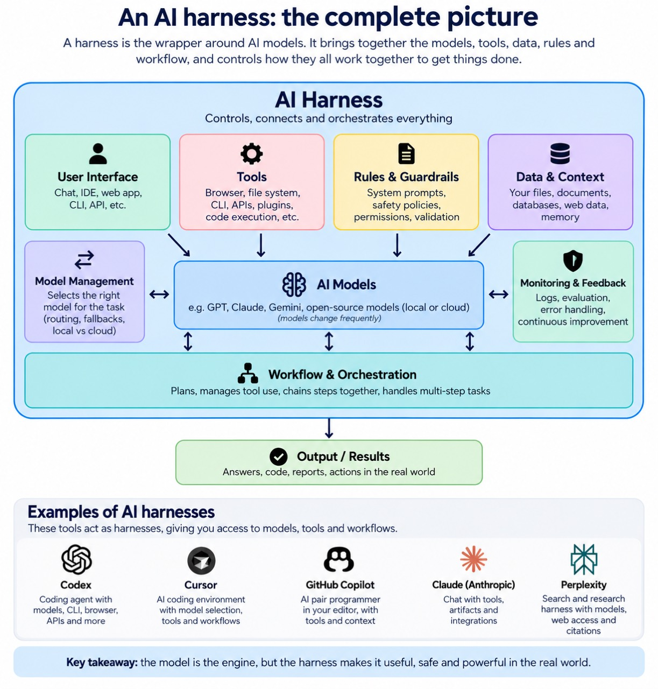

I’ve spent the last few years watching AI tools move from simple chat boxes to systems that can help with much larger pieces of work.

At first, I thought the model was the whole story. Pick the best model, write a good prompt, and the quality of the answer would follow. That mental model worked reasonably well for asking questions or generating a short piece of text.

It started to fall apart when I asked AI to do work involving files, decisions, tools, tests, and several steps. A model might suggest a useful change, but it still needed access to the right project, clear instructions, permission to act, and a way to check whether the result was actually correct.

This is where the word “harness” started appearing in conversations about AI.

The word sounds as if it belongs in a stable rather than a software discussion, but it is a useful way of describing the system around an AI model. Once I started seeing the term used in recent AI writing, I realised it described a lot of the work I was already doing.

In this post, I’ll explain what an AI harness is, why people are talking about them, and why [Codex](https://developers.openai.com/codex) is my harness of choice.

## The Model Is Not the Whole Machine

The easiest analogy I’ve found is a car.

An AI model is like the engine. It can generate a lot of power, but an engine on its own cannot take you to the shops. It needs steering, brakes, wheels, a dashboard, a route, and somebody deciding where to go.

The model is the part that reasons, predicts, and generates an output. It is very important, but it is only one component of a useful system.

The rest of the car is not a distraction from the engine. It is what makes the engine useful.

That is roughly the relationship between a model and a harness:

- The model provides the intelligence that generates or evaluates possibilities.
- The harness provides the surrounding context, tools, rules, permissions, memory, and checks.
- The person using it provides the goal, judgement, and responsibility for the outcome.

This also helps explain the difference between a prompt, an agent, and a harness.

A prompt is like a request to a mechanic: “Please investigate this strange noise.” An agent is the mechanic who can inspect the car, use tools, and make decisions. The harness is the garage, the toolkit, the service manual, the access to the vehicle, the safety rules, and the inspection checklist that lets the mechanic do the job properly.

The words overlap in everyday conversation, but keeping the distinction in mind makes the current AI discussion much easier to follow.

## What Is an AI Harness?

An AI harness is the system surrounding a model or agent that turns its capabilities into a repeatable workflow.

It is not one specific product. It can be a simple set of instructions and a folder of reference documents, or a much more advanced platform connecting an agent to code, databases, browsers, APIs, tests, and other agents.

Think of it as the workshop around the craftsperson. The craftsperson may be highly skilled, but the quality of the work also depends on the materials, tools, instructions, workspace, and quality checks available.

Here are the main parts of a harness.

I found this diagram useful because it shows that the model sits inside a much larger system. The interface is how we interact with it, while the surrounding tools, data, rules, monitoring, and workflow are what help turn an answer into a result.

### Context Is the Briefing Pack

An AI model cannot automatically know which project you mean, what has already been tried, or what constraints matter to you.

Context is the information it needs to do useful work: project files, documentation, examples, previous decisions, data, and the current state of the task.

It is like handing a photographer a location, a shot list, and a little background about the event. Without that information, they may still take attractive photographs, but they are guessing about what matters.

Good context is relevant and current. More context is not always better. Giving an agent every document you have can be like handing a mechanic the entire library of repair manuals and asking them to find the important page themselves.

### Instructions Are the House Rules

Instructions describe how the agent should work.

They might say which language to use, how to format an answer, which commands to run, what to inspect before changing, or when to ask for approval. In a software project, an [`AGENTS.md`](https://learn.chatgpt.com/docs/agent-configuration/agents-md) file can provide this kind of persistent project guidance for Codex.

I think of instructions as the house rules in a shared workshop. They reduce the need to repeat the same expectations every time somebody starts a job.

They also make the workflow more predictable. “Write code” is a broad request. “Read the existing tests first, make the smallest safe change, run the relevant test command, and report anything that remains unverified” is a much clearer operating procedure.

### Tools Are the Hands and Tool Belt

A model that can only produce text can explain how to edit a file, but it cannot necessarily inspect the file or apply the change.

Tools give an agent ways to interact with the world. They might include:

- Reading and editing files
- Running shell commands
- Searching documentation
- Calling an API
- Querying a database
- Opening a browser
- Running tests or builds

The tool belt analogy is useful because tools add capability, but they also add responsibility. A power drill is helpful in the right hands and a bad idea pointed at the wrong surface.

### Permissions Are the Keys and Locked Doors

Tools answer the question “What can the agent do?” Permissions answer the more important question “What is the agent allowed to do?”

An agent might be able to read a project but not delete files. It might be able to edit a working folder but not access personal documents. It might be able to run local tests but need approval before using the network or changing production systems.

This is the same principle as a building with different access badges. The cleaner does not need a key to the cash office, and a contractor does not need unrestricted access to every room.

[Sandboxing](https://learn.chatgpt.com/docs/sandboxing) and approval flows are therefore part of a harness, not an afterthought. They create boundaries around useful autonomy.

### Memory Is the Notebook on the Workbench

Memory can allow an agent to carry useful information between tasks or throughout a longer task.

That might include preferences, previous decisions, project conventions, or the current status of a workflow.

But memory needs care. A notebook with an old instruction in it can be worse than no notebook at all. Good harnesses separate durable knowledge from temporary conversation details and make it possible to correct stale information.

### Orchestration Is the Foreman and the Checklist

Orchestration is how the different parts of the workflow are arranged.

For a small task, that might simply be:

1. Read the request.
2. Inspect the relevant files.
3. Make a change.
4. Run a check.
5. Report the result.

For a larger task, orchestration might arrange several stages, decide which tool to use, pause for approval, and make sure each stage produces what the next one needs.

It is the difference between handing someone a box of tools and giving them a sensible order of work.

### Validation Is the Test Bench

The final part is checking the work.

An agent saying “done” is not the same as the task being done. A harness can run tests, compare output with an expected result, check a build, inspect a diff, or ask a human to review the change.

This is like putting a repaired bicycle on a stand and testing the brakes before handing it back. The repair might look fine while the bicycle is stationary, but the test reveals whether it works when it matters.

Validation is one of the most important differences between an impressive demonstration and a dependable workflow.

## A Simple Example: Fixing a Slow Website

Imagine asking an AI tool:

> “Find out why my homepage is slow, fix it, and make sure the fix works.”

A model without much surrounding structure might give you a list of possible causes or generate a code snippet. That can still be useful, but it leaves much of the job with you.

A harness turns the request into a workflow:

- **Context:** the project files, recent changes, performance notes, and existing documentation
- **Instructions:** the supported framework, coding conventions, and rules about not changing unrelated features
- **Tools:** file search, editing, a terminal, and a performance or test command
- **Permissions:** access to the project folder, with approval required for production changes
- **Orchestration:** inspect first, propose a plan, implement the smallest change, then test it
- **Validation:** compare the result with a baseline and inspect the final diff

The model is still doing the reasoning, but the harness makes that reasoning useful in a real environment.

This is why two people can use the same model and have completely different experiences. One person may provide a clear project, useful context, safe tools, and strong checks. The other may open an empty chat and hope the model guesses everything.

## Why Is Everybody Talking About Harnesses?

The term is suddenly much more visible because the way we use AI is changing.

### AI Is Moving Beyond One-Shot Answers

Much of the early everyday AI use was conversational. Ask a question, receive an answer, and decide what to do next.

That is still useful, but newer workflows ask AI to complete a sequence of actions. An agent might inspect a codebase, make a change, run a test, learn from a failure, and try again.

The moment AI starts acting rather than only replying, the surrounding system becomes impossible to ignore.

### Small Mistakes Have Bigger Consequences

A slightly awkward paragraph is easy to edit. A wrong answer that changes a database, removes a file, or deploys broken code is a different kind of problem.

As AI tools gain access to more capable actions, people need to think about boundaries, approvals, audit trails, and recovery. The harness is where those protections live.

### Reliability Is a System Problem

It is tempting to compare models as if choosing a more capable model solves everything. In practice, a strong model with poor context can struggle, while a slightly less capable model with the right tools and a well-designed workflow can be very effective.

The model matters, but so do the conditions in which it works.

This is similar to judging a chef only by the quality of the ingredients while ignoring the kitchen, the recipe, the equipment, and the time available. The ingredients matter, but the meal is produced by the whole system.

### Harnesses Make Good Work Repeatable

People do not want to explain the same project rules, formatting preferences, or safety boundaries in every conversation.

They want to save useful instructions, package repeatable procedures, connect the tools they already use, and improve the workflow over time. That is harness thinking, even if nobody uses the word.

A well-designed harness turns a one-off interaction into a repeatable way of working. It preserves the right context, applies the same rules, provides the right tools, and makes the important checks visible.

The vocabulary may be new to many people, but the underlying ideas are familiar. Checklists, permissions, clear roles, and feedback have been part of good operations for a long time.

## Why Codex Is My Harness of Choice

I use Codex as my harness of choice because it puts the model close to the work I am actually trying to complete.

I’m a DevOps engineer, but my work is not limited to writing deployment files or responding to incidents. A large part of it is knowledge work: understanding systems, investigating failures, comparing options, documenting decisions, learning unfamiliar technology, and explaining the result clearly.

Codex has become part of that day-to-day work for me. I use it to investigate logs and configuration, understand unfamiliar Azure, Kubernetes, Docker, and CI/CD behaviour, compare possible approaches, turn investigations into runbooks, and organise rough notes into useful documentation. **I still verify** commands and evidence, but the harness keeps the relevant files, notes, tools, and checks close to the conversation.

Codex gives me a practical environment for doing that. Depending on the project and setup, the harness around the model can include:

- The selected project and its existing files
- Conversations that retain the immediate task context
- `AGENTS.md` instructions for project-specific rules
- File search and editing tools
- An integrated terminal for builds, tests, and diagnostics
- [Skills](https://developers.openai.com/plugins/concepts/skills) that describe repeatable workflows
- Sandboxing and approval boundaries
- Git diffs and [worktrees](https://learn.chatgpt.com/docs/environments/git-worktrees) for reviewing or separating changes

The model is only one part of that experience. The rest is what lets me move from an idea to a change that I can inspect and test.

I also use Codex to build apps and useful productivity utilities:

- **Apps:** native iOS apps and small web applications that solve a problem in my own life.
- **Productivity utilities:** task management dashboards, cost analysis reports, scripts, and small automations that reduce repeated effort.
- **Practical learning projects:** experiments that help me learn new skills, new workflows, or a new technical idea by actually using it.

That is the distinction that matters to me. Codex does not remove the need to understand what I am building. It gives me a structured place to ask questions, make changes, investigate failures, and learn from the result.

## What My Codex Workflow Looks Like

I have found that Codex works best when I treat it as a collaborator operating inside a harness, rather than as a magic box that should guess the finished product.

My usual workflow looks something like this:

1. **Start with the outcome.** I describe the problem I am trying to solve and what success should look like.
2. **Add context and constraints.** I explain the existing project, the platforms involved, the preferred technologies, and anything that must not change.
3. **Ask for a plan.** For work that spans several files or decisions, I want the shape of the solution understood before implementation starts.
4. **Make one focused change.** Smaller changes are easier to review and easier to undo when an assumption turns out to be wrong.
5. **Build and test.** The tool can help run the relevant commands, but I still need to understand what those checks prove and what they do not prove.
6. **Review the result.** I read the diff, inspect the output, and for visual work I use the actual interface rather than assuming the code tells the whole story.
7. **Improve the harness.** If Codex repeatedly misses a project convention, I add that convention to the project instructions or a reusable workflow.

That final point is the bit I find most interesting. Every mistake or repeated explanation is a clue that the harness could be improved.

## A Good Harness Still Needs Human Judgement

A harness is not a guarantee that the result will be correct.

It is more like a seatbelt, a sat-nav, and a dashboard. Those things make driving safer and more manageable, but they do not make the driver infallible or remove the need to pay attention to the road.

There are still several things to watch for:

- The context may be incomplete or out of date.
- The model may misunderstand the goal.
- A tool may return an unexpected result.
- A test may pass without proving the whole feature works.
- Too many instructions may create noise instead of clarity.
- Too many permissions may create unnecessary risk.

The best harnesses make these limitations easier to see. They provide checkpoints, show what changed, preserve the original content, and make it clear what has been tested.

That is also why I am cautious about the phrase “fully autonomous”. The useful goal is usually bounded autonomy: let the agent take care of well-defined work while keeping people involved at the decisions that matter.

## Final Thoughts

An AI model can be remarkably capable, but capability on its own is not the same as usefulness.

The harness is the system that gives the model a place to work, the context to understand the task, the tools to take action, the boundaries to stay safe, and the checks to show whether the job is really finished.

That is why everybody seems to be talking about harnesses now. As AI moves from generating answers to helping complete workflows, the surrounding design becomes just as important as the model underneath it.

Codex is my harness of choice because it brings those pieces together around real projects. It helps me move from a rough idea to something I can inspect, test, and improve, while still keeping me responsible for the decisions.

You do not need to build a huge AI platform to start thinking this way. Pick one repeatable task, give it the right context, define a few boundaries, and add a meaningful check at the end. You may already be building a harness without realising it.
