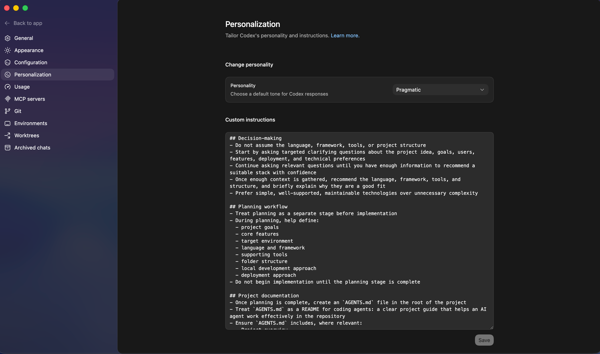
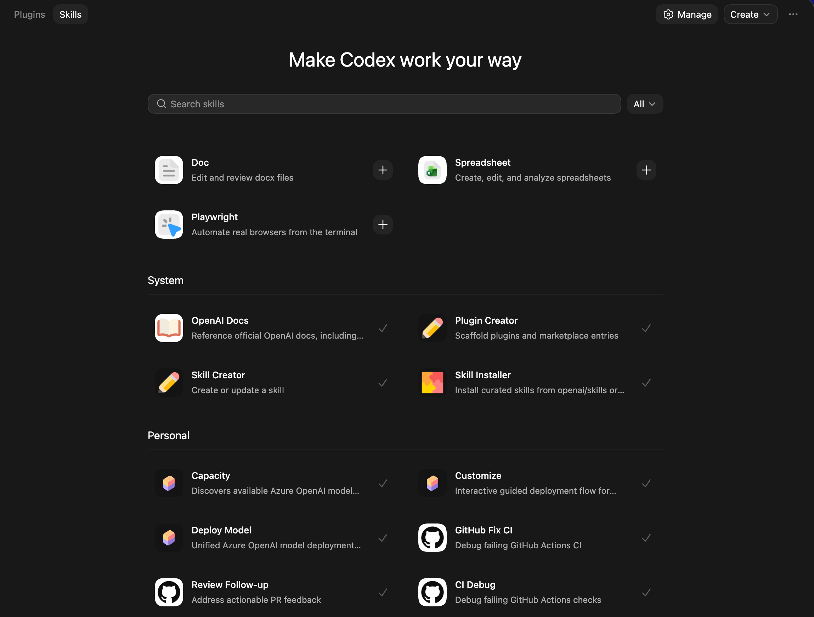
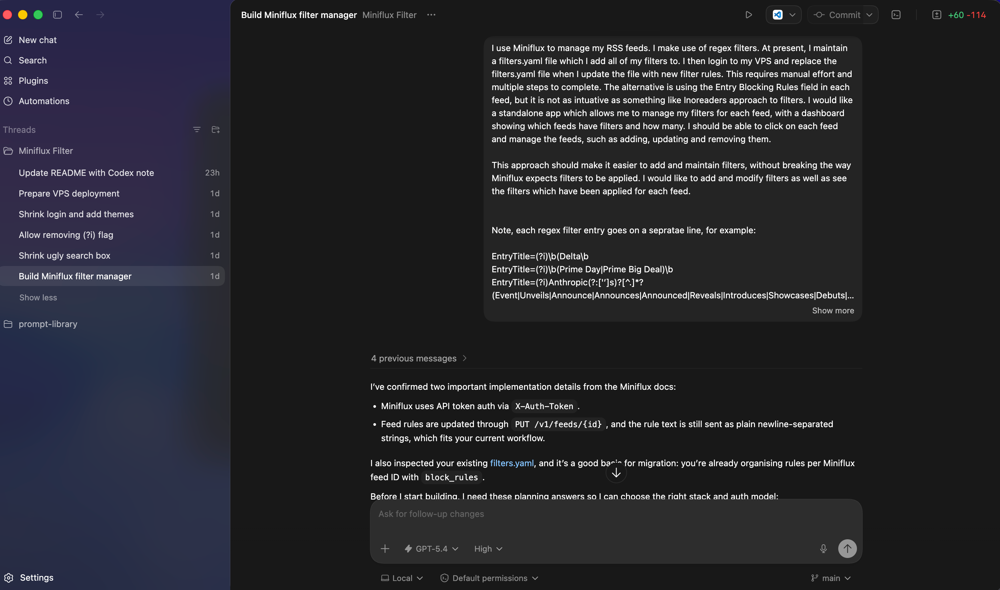

I’ll be honest, Codex sat on my radar for a while before I actually gave it a proper go.

Every time I read about “agentic coding”, it felt like something aimed at experienced developers. It came across as the kind of tool you needed to already understand before it became useful. In reality, there is some truth to this and while Codex isn’t just for developers, it definitely helps to have some core technical skills such as installing tools, basic coding concepts, and source control.

Even though I wouldn’t call myself a developer, curiosity eventually won and I started digging into Codex, following a mix of YouTube tutorials and the [Codex documentation](https://developers.openai.com/codex/cli), and what I realised pretty quickly is that it’s not about being a developer. It’s about being able to describe what you want clearly and working with the tool to achieve the final result.

This post is a practical introduction to Codex based on my own notes and experience getting started.

## What is Codex?

[Codex](https://developers.openai.com/codex) is an AI-powered coding agent that can help you write, understand, and manage code. But more importantly, it behaves less like a code autocomplete tool and more like an assistant that can take actions.

Instead of just suggesting snippets, it can:

* Write and edit code across multiple files

* Read and understand existing codebases

* Run tasks like testing and debugging

* Plan and execute multi-step changes

That last point is what makes it feel different. You’re not just prompting for output, you’re giving it work to do.

## Installing Codex

Getting started is surprisingly straightforward.

### Using Homebrew

```bash

brew install codex

```

### Using npm

```bash

npm i -g @openai/codex

```

Once installed, just run the ```codex``` command and follow the sign-in process.

Ways to Use Codex

One thing I didn’t expect is how flexible Codex is depending on how you like to work.

### Desktop App

The [Codex desktop app](https://developers.openai.com/codex/app) is a much more approachable starting point and is available on macOS and Windows.

1. Download the application.

2. Log in with your account

3. Select a folder or repository

4. Start describing what you want to build

The desktop app is my favourite way to use Codex and OpenAI are adding new features all of the time.

## Configuration: Making Codex Work for You

This is where things started to click for me.

Codex isn’t just a tool you use, it’s something you shape over time.

### Global Configuration

Codex stores global settings in ```~/.codex/config.toml```. This controls how it behaves across all projects.

An example of my config.toml file (to show how customisable Codex is in practice):

```bash

model = "gpt-5.4"

model_reasoning_effort = "medium"

personality = "pragmatic"


[projects."/Users/nathan/Dev/agents.md"]

trust_level = "trusted"


[projects."/Users/nathan/Dev/subscription-tracker"]

trust_level = "trusted"


[projects."/Users/nathan/Dev/prompt-library"]

trust_level = "trusted"


# Disable anonymous usage statistics sent to OpenAI.

[analytics]

enabled = false


# Disable the "/feedback" command and prompts.

[feedback]

enabled = false


[plugins."github@openai-curated"]

enabled = true

```

### Project-Level Configuration

You can override global settings, allowing each project to have its own tailored behaviour and preferences:

To configure project-specific settings:

* Create a `.codex/` directory in the root of your project

* Add a `config.toml` file inside this directory

* Define any settings you want to override from the global configuration

These project-level settings take precedence over the global configuration, making it easy to customise Codex for different workflows, tools, or environments.

### Custom Instructions

Custom instructions allow you to shape how Codex behaves when it helps you with coding tasks. Instead of changing the model itself, you provide **persistent guidance** that Codex follows every time it responds.

These instructions act as a **context layer** that influences:

* **Tone and communication style** (e.g. beginner-friendly vs concise expert)

* **Level of explanation** (step-by-step vs high-level)

* **Task approach** (e.g. explain before coding, or code first then explain)

* **Constraints and preferences** (tools, languages, workflows)

#### How to Use These Effectively

* Start with **one core instruction set** (e.g. Beginner-Friendly Builder Mode)

* Add small tweaks over time as you notice gaps

* Keep instructions **focused and specific** (avoid overly long prompts)

For example, I set mine up to:

* Explain things simply before writing code

* Break work into steps

* Help plan projects before building

* Prefer simple, maintainable solutions

This turns Codex into something that feels tailored to you, rather than generic.



## AGENTS.md: The Missing Piece

This was a big moment for me. An `AGENTS.md` file acts like a guide specifically for AI agents working on your project.

It typically includes:

* Project overview

* Tools and frameworks

* Build and test commands

* Code style rules

* Deployment notes

* Security considerations

Think of [AGENTS.md](https://agents.md/) as a README.md for agents: a dedicated, predictable place to provide the context and instructions to help AI coding agents work on your project.

Instead of repeating yourself in prompts, you define the rules once and let Codex follow them consistently.

One important lesson here: keep it concise. It’s easy to overdo it.

## Plan Mode: Thinking Before Doing

Plan mode is a Codex feature that focuses on thinking before acting. Instead of immediately generating code or making changes, Codex first creates a structured plan for how to approach the task.

Instead of jumping straight into changes, Codex will:

* Break a task into steps

* Show you the plan

* Let you review it before execution

This is especially useful when:

* Working across multiple files

* Refactoring existing code

* Building new features

It reduces mistakes and gives you more control over what’s about to happen.

## Worktrees: Safe Experimentation

Worktrees sounded intimidating at first, but they’re actually quite simple. Worktrees are separate working copies of your project that allow Codex to run multiple tasks without conflicts.

They allow Codex to:

* Create separate working environments

* Run multiple tasks in parallel

* Avoid conflicts with your main project

So instead of worrying about breaking something, you can just let Codex try things in isolation.

It’s a much safer way to experiment.

## Skills and MCP

These two features really expand what Codex can do.

### Skills

Skills are a lightweight, open format for extending AI agent capabilities with specialised knowledge and workflows that teach the agent how to perform specific jobs more reliably and efficiently.

At its core, a skill is a folder containing a `SKILL.md` file. This file includes metadata (`name` and `description`, at minimum) and instructions that tell an agent how to perform a specific task. Skills can also bundle scripts, templates, and reference materials.

You define a skill and Codex can reuse it across projects and it saves a lot of repetition over time.



### MCP (Model Context Protocol)

MCP is a standard that allows Codex to **connect to external tools, services, and data sources** in a structured and secure way.

* **Connects Codex to tools** – Enables access to APIs, databases, file systems, and other services

* **Standardised interface** – Provides a consistent way for Codex to interact with different systems

* **Extends real-world capabilities** – Lets Codex go beyond code generation to fetch data, trigger actions, or integrate with workflows

* **Modular and reusable** – MCP integrations can be reused across projects and environments

MCP is the bridge that lets Codex interact with external systems, turning it from a coding assistant into a tool that can take real actions.

That means it can:

* Access APIs

* Query databases

* Interact with systems outside your codebase

This is where it starts to feel less like a coding tool and more like something that can actually operate within your environment.

## Security and Control

One concern I had early on was: how much control does this thing actually have?

By default, Codex runs in a sandboxed environment.

* Limited file access

* Approval required for sensitive actions

* Configurable permission levels.

You stay in control the whole time and you can gradually increase what it’s allowed to do as you get more comfortable.

## A Few Practical Tips

A few things that helped me early on:

* Start with small tasks and build up

* Be clear and specific in your instructions

* Include steps to verify results (tests, builds, etc.)

* Paste full error messages when debugging

* Let Codex suggest improvements, not just fixes

It’s less about perfect prompts and more about good communication.

Here is an example of a project I worked on. I used plan mode to work with Codex on the initial idea before building the app:



## Final Thoughts

Getting started with Codex has changed how I think about building things. I’m not a developer, but it makes building feel far more accessible.

From my perspective, it’s less about writing code and more about thinking clearly, breaking problems down, and guiding the tool. There is still a learning curve, and you do need some technical grounding, but you don’t need to know everything upfront.

Start small, experiment, and iterate. That’s been the biggest shift for me.

You really can just build things.
