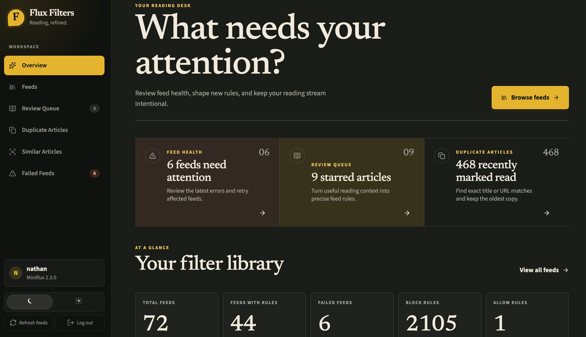
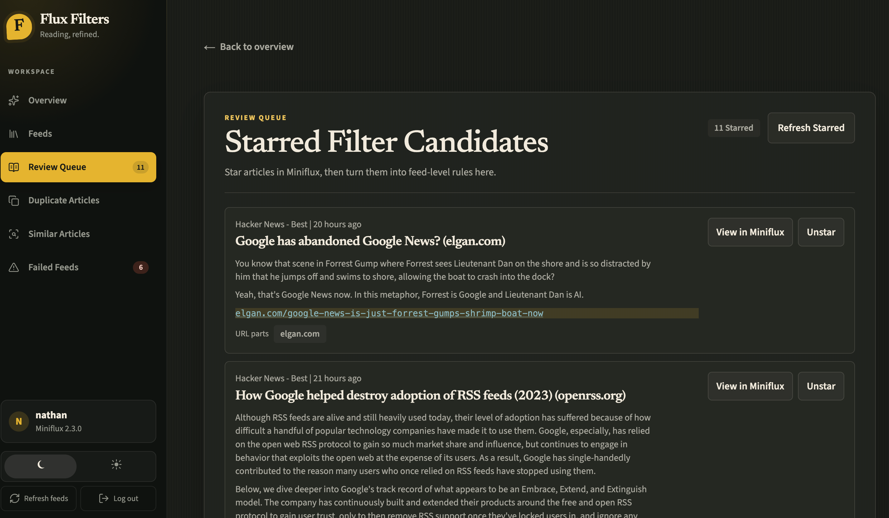

RSS has been part of how I stay informed for years. I like choosing the sources I follow, receiving every new article in one place, and avoiding an algorithm deciding what deserves my attention.

My RSS reader of choice is [Miniflux](https://miniflux.app/). It is fast, powerful, and gives me the control I want over my feeds. It is not the most aesthetically pleasing application to read from, though, so on iOS I use ReadKit as the interface for working through my articles.

That combination works well, but the scale of my RSS setup created a different problem. I subscribe to more than 200 feeds, and scanning everything they publish takes time. Different sources often cover the same story, some feeds publish duplicate articles, and plenty of entries are about subjects I do not want to see.

I was still in control of my sources, but I needed better control over the volume.

## When a Curated Feed Still Becomes Noisy

One of the reasons I value RSS is that it lets me build my own information stream. I am not relying on a social network to select articles for me. Every feed is there because I chose to subscribe to it.

However, choosing the sources does not automatically make every article useful.

With more than 200 feeds, I regularly encounter:

- The same article appearing through more than one feed
- Several publications covering an identical news story
- Similar headlines that add little new information
- High-volume feeds where only certain topics interest me
- Old or broken feeds that need attention

I already used regex filters in Miniflux to reduce some of this noise. Regex, short for regular expressions, lets you describe a text pattern and use it to allow or block matching articles. For example, a rule can hide entries containing a particular subject in the title or only allow articles matching topics I care about.

The filtering itself is powerful. Managing a growing collection of raw rules across hundreds of feeds is less convenient.

I wanted a clearer way to see which feeds had filters, create new rules, review what was being filtered, and identify the stories that were appearing repeatedly across my subscriptions. There was no native Miniflux view that brought all of that together in the way I wanted.

That became the starting point for Flux Filters.

## What Is Flux Filters?

[Flux Filters](https://github.com/aut0nate/Flux-Filters) is a personal web application that sits on top of Miniflux and works through its API.

Miniflux remains the source of truth. Flux Filters reads the feeds, articles, and existing rule text from Miniflux, presents them through a purpose-built interface, and writes compatible rules back. It does not try to replace my RSS reader or introduce a completely separate system.

Instead, it gives me a portal designed around the parts of feed management that matter most to me:

- Viewing feeds and seeing which ones already have block or allow rules
- Creating and managing regex filters through a clearer editor
- Turning starred articles into draft rules based on their titles, authors, tags, or URLs
- Reviewing exact duplicate articles before marking newer copies as read
- Finding strongly similar headlines across different feed categories
- Seeing failed feeds, reviewing their errors, and retrying them
- Reviewing recent duplicate-clean-up activity

This is the kind of application that probably would not exist as an off-the-shelf product because it is shaped around one very particular workflow: mine.

That is also exactly why it is useful.

## Surfacing Important Stories Without Reading Every Version

Filtering unwanted subjects was only one side of the problem. I also wanted to understand which stories were appearing at high volume.

When several independent feeds cover the same event, that is useful information. It can signal that a story is important, but it can also leave me scanning several slightly different versions of the same article before I realise they are all about one topic.

Flux Filters approaches this in two ways.

The duplicate view looks for exact matches using normalised titles or URLs. It keeps the oldest article as the reference and lets me mark newer unread copies as read. The matching is deliberately conservative because I do not want an automated process hiding articles simply because they happen to sound alike.

The similar articles view deals with the less obvious cases. It looks for strong overlap between significant words in headlines across different categories, then groups likely matches for me to review. Nothing changes until I confirm which articles should be marked as read.

That human review is important. The application helps me find the patterns, but I still make the final decision.

The result is that I can quickly see when a topic is generating a lot of coverage, choose the version I want to read, and clear the repetition without opening every article individually.

## Making Regex Filters Easier to Manage

Regex is extremely useful, but long blocks of patterns are not always pleasant to maintain directly.

Flux Filters gives those rules a more approachable interface. I can browse my feeds, see where rules already exist, add block or allow patterns, and keep their order visible. Rule order matters because Miniflux stops at the first matching rule.

One of my favourite parts of the workflow starts in Miniflux itself. If I see an article that should become the basis of a filter, I can star it. Flux Filters then shows that article in a review queue and helps me create a draft rule from its title, author, tags, URL, or selected text.

That gives me a useful bridge between reading and maintaining the system. I do not need to stop, remember the exact wording, and manually construct every pattern from scratch. I can capture the example while I am reading and deal with it later in a dedicated interface.

It has made the filtering process feel much more intentional and far less cumbersome.

## Building It with Codex

I built Flux Filters by working with Codex, specifically the latest GPT-5.6 Sol model.

I did not begin with a complete application specification or a detailed technical design. I began with the outcome I wanted: a better way to manage the volume, repetition, filters, and feed health within my Miniflux setup.

From there, I worked with Codex to turn that personal frustration into a plan. We broke the application into smaller parts, considered how each part should interact with the Miniflux API, built the interface, tested the behaviour, and kept refining it as I used it.

Codex helped me create:

- A clean, responsive interface that I enjoy using
- A feed browser and regex rule editor
- Review workflows for starred, duplicate, and similar articles
- Feed health and retry controls
- Automated tests for the important matching behaviour
- Docker packaging so I can run the application on my own infrastructure
- Clear project documentation so future changes have the right context

The most valuable part was not simply asking Codex to write code. It was being able to describe the problem in plain language, review a proposed approach, test what it built, and then explain what I wanted to improve.

That iterative process let the application grow around the real workflow rather than an imagined one.

## A Better Daily Reading Workflow

Flux Filters has drastically improved the time I spend processing RSS.

ReadKit is still where I prefer to read on iOS, and Miniflux still handles my feeds. Flux Filters has become the management layer that keeps everything around that reading experience under control.

My workflow now has a clearer shape:

1. Miniflux fetches articles from the feeds I have chosen.
2. My block and allow rules remove subjects I know I do not want.
3. Flux Filters helps identify exact duplicates and closely related coverage.
4. I review high-volume stories and choose which articles are worth reading.
5. Failed feeds are visible in one place when they need attention.
6. I read the resulting, more focused stream in ReadKit.

This does not mean every decision is automated, nor would I want it to be. The aim was not to build another algorithm that decides what I am allowed to see. It was to create better controls around the sources I had already chosen.

I now spend less time clearing repeated or irrelevant articles and more time reading useful ones. Most importantly, I am surfacing higher-quality content, which was exactly what I wanted when I started the project.

## Personal Tools Built Around Personal Problems

Flux Filters has reinforced something I have been thinking about for a while: agentic tools such as Codex put a new kind of capability into the hands of people who are not traditional developers.

I would not describe myself as a professional developer. I come at these projects with ideas, technical curiosity, and experience from the operations side. In the past, a tool this specific might have remained a note describing something I wished existed.

Now I can work with Codex to bring it to life.

That does not remove the need to think carefully. I still need to explain the outcome, review decisions, test the application, protect secrets, and make sure the behaviour matches what I intended. Codex gives me leverage, but I remain responsible for directing and verifying the work.

What changes is the distance between an idea and a working tool.

I am seeing people from many different backgrounds build applications, automations, and small utilities around problems they understand deeply. These tools may be too personal or specialised to become commercial products, but that does not make them less valuable. In many cases, their specificity is the reason they work so well.

## Final Thoughts

Flux Filters started with a simple frustration: I had built a valuable collection of RSS sources, but managing the volume was taking too much time.

By combining Miniflux, ReadKit, and a purpose-built management layer, I now have an RSS workflow that feels much closer to what I always wanted. I can manage filters more easily, repair failed feeds, review duplicate and similar coverage, and spend more of my time on the articles that are actually worth reading.

For me, this is the real power of working with Codex. It is not about generating software for the sake of it. It is about being able to build the tools you have always wanted, around problems that are relevant and unique to you.

I am enjoying bringing these ideas to life, one useful outcome at a time.
