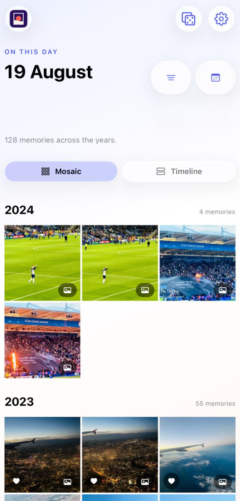
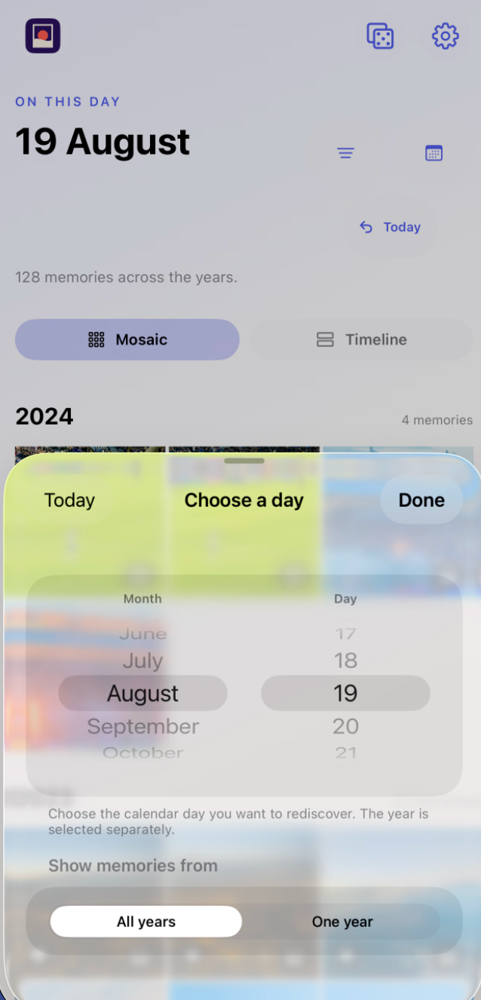
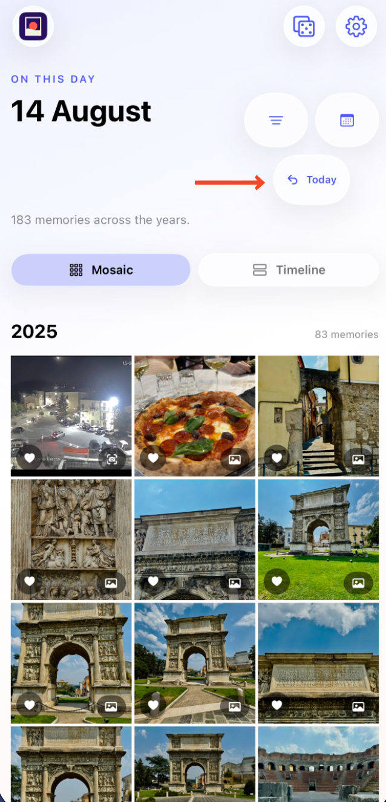
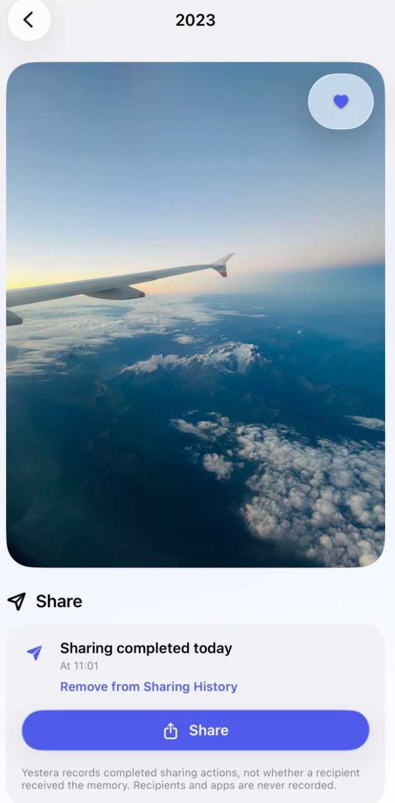
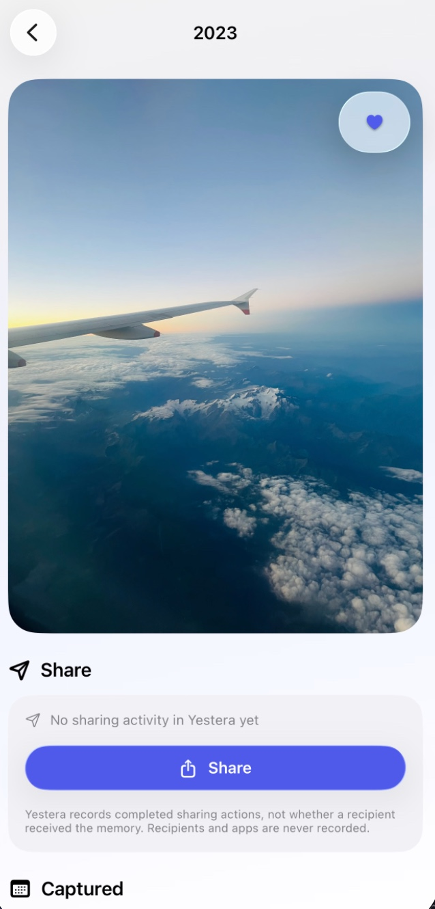
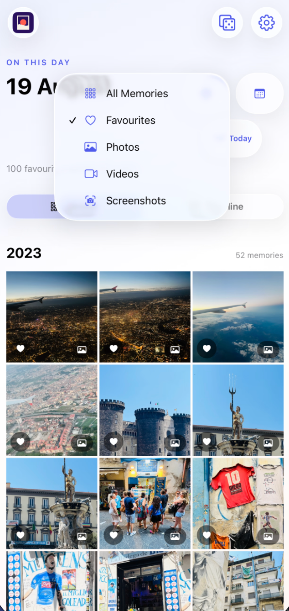
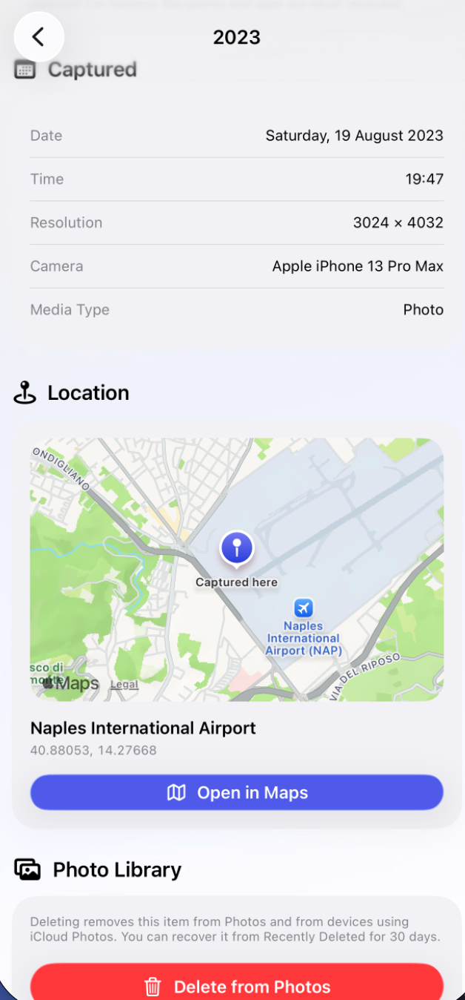
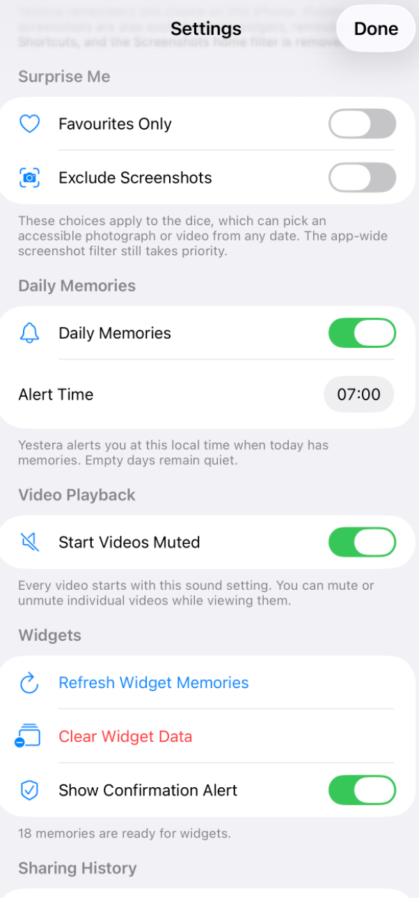
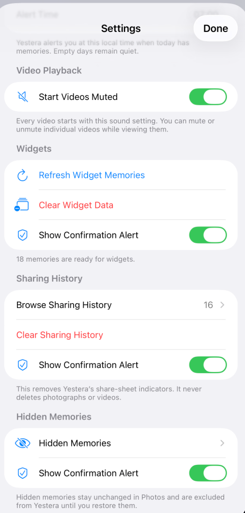

I’ve always taken more photographs and videos than I can realistically revisit. My iCloud Photos library has grown into a huge collection of family moments, holidays, ordinary days, and small things that seemed worth capturing at the time.

Apple Photos does a very good job of storing all of that media. The problem is that storing something and remembering it are two different things. As the library grew, older photographs and videos gradually disappeared from my day-to-day view.

That was particularly noticeable with photographs of our son. I already use a Shortcut to send photographs to my partner, but I wanted a better way to find something different each time. I did not want to keep returning to the same recent images while thousands of older memories were effectively forgotten.

That idea became [Yestera](https://apps.apple.com/id/app/yestera/id6794884597), my first iOS app. I built it with [Codex](https://developers.openai.com/codex), specifically using the 5.6 Sol model, and it is now available for free on the App Store.

## What Yestera Does

At its core, Yestera looks at the photographs and videos in the existing Photos library and finds the ones captured on the same calendar day in previous years.

If I open Yestera on 2 September, for example, it can show the memories captured on 2 September across the years in my library. The results are grouped by year, with the newest year first by default, so the experience feels more like revisiting a collection of memories than searching through a database.

The app is deliberately an overlay of the library I already have. It does not create a second photo collection, require an account, or ask me to import everything into another service. Yestera reads the Photos library on the device, including media that is managed through iCloud Photos, and presents it in a way that makes older memories easier to find.

That simple idea shaped almost every product decision that followed.

## Building My First iOS App

I’m not a traditional software developer. My background is closer to the operations side of technology, so I had some useful technical experience, but I had never built and shipped an iOS app before.

I knew what I wanted Yestera to feel like. I wanted it to be calm, visual, private, and easy to use. I did not initially know how to structure a SwiftUI application, work with the Photos framework, handle video and Live Photos, or make the interface behave properly across different states.

This is where Codex became particularly useful for me.

I used Codex to work through the project in stages. I could describe the experience I wanted in plain language, then use the resulting discussion to define the screens, data flow, technical constraints, and testing approach before making changes.

The important part was not simply asking Codex to write an application. The useful workflow was more deliberate:

- Describe the problem and the intended user experience
- Agree the boundaries of the first release
- Break the work into small feature areas
- Ask Codex to implement one focused change at a time
- Build and test the result
- Check the actual interface rather than assuming the code was enough
- Refine the behaviour when something felt awkward

Using the 5.6 Sol model gave me a capable technical partner while I remained responsible for the product decisions. I still had to explain what I wanted, question suggestions, review changes, and test the result. Codex made the unfamiliar parts more approachable, but it did not remove the need to think carefully about what I was building.

## Choosing Native Apple Frameworks

Yestera is built with Swift and SwiftUI, using Apple's own frameworks wherever they fit the problem.

PhotoKit is the foundation because it allows the app to work with the user's existing Photos library. It provides the creation dates, favourites, thumbnails, locations, and media access that Yestera needs without requiring a separate backend or copy of the library.

The rest of the app uses native tools for the parts they are designed to handle:

- SwiftUI for the interface
- PhotoKit and PhotosUI for library access and media requests
- AVKit and AVFoundation for video playback
- MapKit for recorded locations
- SwiftData for the small, device-local sharing history
- UserNotifications for daily reminders
- WidgetKit and App Intents for widgets and Shortcuts

Using native frameworks was important to me. It keeps the application closer to the platform, reduces unnecessary dependencies, and means the app can follow familiar iPhone behaviour.

It also made the privacy model easier to reason about. The media stays in Photos, the matching and filtering happens on the device, and the only extra history Yestera needs is stored locally.

## A Timeline for the Same Day

The main Yestera screen opens on today's date. The initial Mosaic view gives me a quick visual overview, while the Timeline view presents the same memories in a more editorial layout.

Each year is shown as its own group. The year headings and memory counts are kept visible, which makes it easier to understand how many years are represented and how the day has changed over time.

The calendar control beside the date lets me choose a specific month and day. It remains yearless by design, because the purpose is to compare that day across the library. I can keep the results showing all matching years or narrow them to one particular year when I want to look at a single event.

I can also swipe horizontally to move to the previous or next date. When I move away from today, a labelled Today button appears below the calendar so I can return to the current date quickly. The app also remembers the layout and ordering preferences I choose, so I can configure it around the way I like to browse.

The date navigation sounds like a small detail, but it changes how I use the app. I’m not just opening a search screen and leaving again. I can move through nearby days, pause on something interesting, and let the timeline become a gentle way of exploring the library.

## Sharing Memories Without Repeating Myself

Sharing was part of the idea from the beginning.

As I mentioned earlier, I use a Shortcut to send photographs of our son to my partner. That is a useful workflow, but I wanted Yestera to help me avoid sending the same memory repeatedly.

When the system reports that a sharing activity has completed, Yestera stores a small record on the device. It then shows a discreet indicator or message on that specific memory. If I shared it recently, I can see that context while browsing and choose a different photograph instead.

The app does not pretend to know whether somebody received or opened the media. It only records the fact that iOS reported a completed sharing action. It also does not store the recipient, the destination application, or a copy of the photograph in the sharing history.





I can share a memory again, remove an individual history record, or clear the local history from Settings. This has become one of my favourite parts of Yestera because it turns sharing into something I can do with a little more intention.

## Notifications I Actually Look Forward To

Yestera includes optional daily-memory notifications, and this is a feature I genuinely enjoy receiving.

I can choose the time that suits me, rather than having the app interrupt me at an arbitrary moment. The default is 7:00 am, but it can be adjusted in Settings. If there are memories available for the day, the notification tells me how many there are and opens today's view when I tap it.

Yestera stays quiet when there is nothing to show. That matters because the reminder remains useful instead of becoming another notification that I automatically dismiss.

The notifications are local to the device. There is no remote notification service or developer-operated backend behind them. The app prepares the reminder from the Photos library and follows the system's own rules for delivery, Focus, and Scheduled Summary.

## Surprise Me

Sometimes I do not want to choose a date at all. I just want to see something unexpected.

The dice button in the top-right corner opens a random memory from anywhere in the accessible Photos library. It is a simple way to surface something I might never have thought to look for.

I can also configure Surprise Me to choose from favourites only or to exclude screenshots. Those preferences are remembered separately from the normal timeline filters, so the dice remains a distinct way of exploring the library.

I like this because it changes the role of the app. The timeline helps me revisit a particular day, while Surprise Me gives the library a little unpredictability.

## Favourites, Screenshots, and Different Views

Yestera recognises the favourite state from Apple Photos, rather than creating a separate favourite system that could become out of sync. I can change that state from the detail view, and favourited memories are marked in the Mosaic and Timeline presentations.

The main filter lets me narrow the current date to:

- All Memories
- Favourites
- Photos
- Videos
- Screenshots

Screenshots are treated separately from photographs. I can also enable a setting to exclude screenshots throughout Yestera, including the main results, year counts, notifications, widgets, and Shortcuts. That is useful for me because screenshots are part of my Photos library, but they are not usually the kind of memory I want resurfaced.

The filter stays with me while I move between dates and year scopes during the current session. That means I can browse only videos across several days, or look through favourites without repeatedly rebuilding the same filter.

## Remembering Where a Photograph Was Taken

Opening a memory provides more than a larger version of the image. Yestera shows capture information such as the date, time, resolution, camera model, media type, and video duration where those details are available.

If the photograph contains recorded location information, Yestera displays it on a map and can open that place directly in Apple Maps. This gives me a way to remember not only what happened, but where it happened, and makes it possible to revisit a location if I want to.

The location comes from the photograph's existing metadata. Yestera does not request my current location just to display an old memory, and it shows a neutral state when the asset has no recorded coordinates.

Photographs, Live Photos, and videos can be opened in a full-screen experience. Videos remain in their original form and start muted by default, while high-quality media is loaded when I actually open the detail view rather than when the timeline is being filled with thumbnails.

## Keeping the App Private

Privacy was not something I wanted to add as a statement after the app was built. It was one of the reasons I wanted Yestera to exist as a local app in the first place.

Yestera does not collect data, use advertising, require an account, or send my photo library to a developer-operated service. It is simply a different way of viewing the Photos library I already use.

The main principles are straightforward:

- Photos access is requested so the app can find relevant media
- Matching, filtering, and metadata handling happen on the device
- The source photographs and videos remain in Apple Photos
- Sharing history is stored locally and contains only minimal activity details
- No recipient or destination information is retained
- There is no external analytics or tracking service

Some media may be stored only in iCloud and need to be downloaded when I open it. That is still handled through Apple's Photos framework and the normal iCloud Photos experience. Yestera does not upload another copy somewhere else.

This local approach also keeps the product focused. I did not need to build user accounts, a synchronisation service, a media-processing backend, or a separate data store for the library itself.

## The Smaller Details That Make It Feel Finished

One thing I learned while building Yestera is that an app can have a simple central idea and still contain a lot of small decisions.

The app supports Home Screen and Lock Screen widgets, so a memory can appear without opening the main interface. It also includes App Shortcuts for opening today's memories, opening memories for a date, counting today's memories, finding an unshared memory, and choosing original media for a later Shortcut action.





Those features are not the reason Yestera exists, but they help it fit into the rest of the iPhone. The same is true of accessibility options, automatic playback choices, remembered appearance settings, the ability to hide an individual memory from Yestera, and the option to restore hidden memories later.

The visual design was important as well. I wanted the photographs and videos to remain the focus, with Liquid Glass used for navigation and controls rather than placed over every part of the content. Getting that balance right took more iteration than I expected.

## What I Learned From Building It

The biggest lesson for me is that building an app is as much about defining behaviour as it is about writing code.

At the beginning, it was tempting to think about the main screen and the visual style first. But the difficult questions appeared around the edges:

- What should happen when Photos access is limited?
- What does a sharing indicator honestly mean?
- How should screenshots behave when they are also favourites?
- What happens when an original video is only in iCloud?
- How should a notification return me to today's memories?
- Which gesture should win when a swipe begins over a memory?

Codex helped me work through those questions, implement the answers, and investigate the bugs that appeared along the way. I still had to test the app in the simulator and on an iPhone, because an interface that looks reasonable in code can feel completely different when it is rendered and used.

That testing loop was especially important for a visual app. I had to pay attention to scrolling, gesture conflicts, loading states, full-screen transitions, video playback, accessibility settings, and the way the design felt with real photographs rather than sample placeholders.

I also learned that constraints are useful. Keeping Yestera iPhone-only, using native Apple frameworks, avoiding a backend, and storing as little as possible made the project more manageable. It gave Codex a clear shape to work within and made the final app easier for me to understand.

## Why I Put It on the App Store

Yestera began as a personal project to solve a problem in my own photo library. I built it because I wanted to use it, and I still use it every day.

I decided to put it on the App Store for free because I thought other people might have the same experience: a large iCloud Photos library full of memories that are safe, but easy to forget. I’m not trying to replace Apple Photos. I wanted to give people another way to look at the moments they already have.

There is something satisfying about opening the app and finding a photograph I had completely forgotten. Sometimes it is a major event, but often it is a very ordinary moment that becomes meaningful simply because I have been given a reason to see it again.

## Final Thoughts

Yestera is my first iOS app, but it is also a personal reminder that a small problem can be worth solving properly.

I wanted a beautiful and private way to revisit photographs and videos from the same day across the years. The timeline, filters, notifications, Surprise Me button, sharing history, favourites, and location metadata all support that central idea in different ways.

Codex and the 5.6 Sol model helped me turn the idea into a working application, but the most rewarding part has been using it myself. It has made my large photo library feel more present without asking me to move it, upload it, or manage another account.

For me, Yestera is not another place to store memories. It is a way of bringing the memories I already have back into view.
