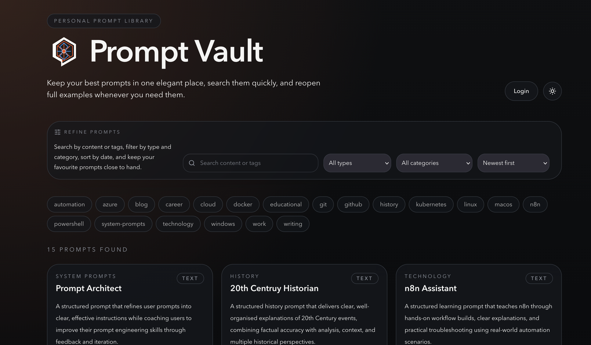

When I first started using Codex, I’ll be honest, I felt completely out of my depth. I remember thinking, “What am I doing? I’m not a developer.” It felt like I was stepping into a world that was built for developers. Sure, there are developer workflows you need to be aware of, but I wasn’t sure if I belonged there.

However, coming from the ops side of DevOps, I had some relevant experience which I could use to bring the ideas that I had, to life. I decided to stick at it and work with Codex daily and it has now become a fundamental part of my workflow.

The more I used it, the more I realised that Codex is not just useful for experienced developers. It is useful for anyone who can explain what they want clearly, break an idea down into steps, and work with the tool as it builds. You still need some technical grounding, especially around files, source control, testing, and deployment, but you do not need to know everything before you start.

One of the best examples of that for me has been building my own [Prompt Vault](https://prompts.autonate.dev/), a simple application for storing, organising, and reusing prompts.

The source code is available on GitHub here:

[https://github.com/aut0nate/Prompt-Vault](https://github.com/aut0nate/Prompt-Vault)



## Why I Wanted a Prompt Library

As I’ve started using AI tools more seriously, prompts have become part of my working toolkit.

Some prompts are quick one-off experiments, but others are worth keeping. They might be prompts for writing, planning, coding, troubleshooting, research, documentation, or automation. The problem is that if they live in random notes, browser tabs, chat histories, or copied text files, they become hard to find when you actually need them.

I wanted something simple:

- A place to save prompts properly
- A way to organise them with tags and categories
- A searchable interface so I could find prompts again quickly
- A public view so other people could browse them
- An admin area so I could manage the library myself

It did not need to be a huge platform. It just needed to solve a real problem in my own workflow.

That is one of the things I like most about using Codex. It lowers the barrier to building small, personal tools that are genuinely useful.

## What I Built

Prompt Vault is a personal prompt library for saving, organising, searching, favouriting, and reusing LLM prompts.

At a high level, the application includes:

- A public prompt library
- Search and filtering
- Prompt detail pages
- GitHub-based login for the admin area
- An admin dashboard for managing prompts
- Support for persistent data and prompt attachments

The app is built with:

- Next.js with the App Router
- TypeScript
- Tailwind CSS
- Prisma with SQLite
- Playwright for end-to-end tests
- Docker for local production-style testing and deployment
- GitHub Actions for CI/CD

I am really pleased with the outcome. It is a simple application and yes, there are many alternatives publicly available, however, I wanted to build my own and Codex helped me bring this to life quickly.

## How Codex Helped

The biggest shift for me was not that Codex could write code. That part is impressive, but it is not the whole story.

The real value was being able to work through the project in stages. I could start with a rough idea such as:

> "I want to build a prompt library application where I can store, tag, search, and manage prompts."

Then Codex could help turn that into a plan:

- What pages the app needed
- What data model made sense
- How authentication should work
- How to structure the project
- What tests should be added
- How to package it for Docker
- How to deploy it safely

That planning step matters. It is easy to ask an AI tool to immediately generate code, but I’ve found Codex works best when you treat it more like a technical collaborator.

My suggestion is to start in plan mode. You explain what you want and Codex asks questions or proposes a plan. You review the plan. Then it starts making changes.

That workflow makes the whole process feel much more controlled.

## Building Locally First

One thing I try to do with these projects is make them work locally before thinking too much about deployment.

For Prompt Vault, the local workflow is fairly standard:

```bash
npm install
npm run prisma:generate
npm run db:push
npm run db:seed
npm run dev
```

That gives me a development version of the app running locally so I can test the core behaviour before worrying about containers or servers.

Codex helped with this by setting up the project structure, wiring up Prisma, adding seed data, and making sure there were clear commands in the `AGENTS.md` file.

That last part is important. The `AGENTS.md` file gives AI coding agents project-specific context. It explains the stack, commands, layout, testing approach, Docker notes, and security rules. Instead of repeating the same context in every prompt, the project carries its own instructions.

For me, that has become one of the most useful patterns when working with Codex.

## Adding Docker

Once the app worked locally, the next step was Docker.

The application runs on my VPS, so I wanted a deployment approach that was predictable and easy to repeat. Rather than building the application directly on the server, the production server pulls a tested Docker image from GitHub Container Registry.

That means the VPS only needs a minimal setup:

- A `docker-compose.yaml` file
- A `.env` file for production secrets
- A `storage/` directory for persistent data

The SQLite database and prompt attachments live outside the container in persistent storage. That way, rebuilding or replacing the container does not remove the data.

This is the kind of deployment detail where Codex is particularly useful. It can help write the Dockerfile, adjust the Compose files, document the storage layout, and point out the risks around secrets and persistence.

It also helps keep the boring but important details visible.

For example, production secrets should live in `.env` on the server, not in GitHub. The database and attachments should be backed up before changes that affect data behaviour. The server should pull the published GHCR image rather than build from source.

None of that is exciting, but it is what makes the app maintainable.

## CI/CD with GitHub Actions

After Docker was working, I wanted the build and deployment process to be more reliable.

The repository uses GitHub Actions to test, build, publish, and deploy the application.

The CI workflow runs on pull requests and pushes to `main`:

1. Checks out the repository
2. Sets up Node.js
3. Installs dependencies with `npm ci`
4. Installs the Playwright browser
5. Runs linting
6. Builds the Next.js application
7. Runs end-to-end tests
8. Builds the Docker image
9. Starts the image and smoke tests the homepage
10. Confirms the build is safe to publish

Once CI passes on `main`, a separate CD workflow takes over. It builds the production image, publishes it to GitHub Container Registry, updates the image tag on the VPS, pulls the new image, and restarts the container.

The published image is pushed to GHCR as:

```text
ghcr.io/aut0nate/prompt-vault:latest
ghcr.io/aut0nate/prompt-vault:<git-commit-sha>
```

The commit SHA tag is useful because it gives each build a specific version. If something goes wrong, I can roll back to a known image instead of guessing what `latest` pointed to at the time.

This is another area where Codex helped a lot. CI/CD can be fiddly because there are several moving parts: environment variables, test databases, Docker build arguments, smoke tests, package publishing, SSH deployment, and repository secrets.

Codex helped turn that into a repeatable workflow where a successful change on `main` can move from tested code to a running container on my VPS without me manually rebuilding and copying files around.

## What I Learned

The main lesson from this project is that Codex works best when you give it context and constraints.

It is not about writing one perfect prompt and hoping the whole application appears. It is more of an iterative process:

- Describe the goal
- Ask for a plan
- Review the suggested approach
- Let Codex make a focused change
- Test the result
- Work with Codex on any errors
- Repeat

That loop is where the value is.

I’ve also learned that small tools are often the best place to start. You do not need to begin with a huge SaaS idea or a complicated system. A prompt library, a dashboard, a tracker, a local automation, or a small workflow tool can teach you a lot.

The important thing is that the tool solves a real problem for you.

## You Do Not Have to Be a Developer

I still would not describe myself as a traditional developer.

What Codex has given me is a way to build things by combining clear thinking, curiosity, and enough technical understanding to guide the process.

You need to be willing to learn. You need to understand what files are changing. You need to care about testing, secrets, and deployment. But you do not need to have every answer upfront.

That is what makes Codex so powerful for me.

It makes building feel more approachable. It lets you move from "I wish I had a tool for that" to actually creating one.

## Where I Want to Go Next

Prompt Vault is only one example. I’ve already used Codex to build various small utilities for personal and work use. Some run on my VPS behind Tailscale, while others just run locally as part of my own workflows.

That local side is something I want to explore more.

Codex has been gaining new features quickly, and I’m particularly interested in its compute capabilities and how they can help automate workflows that I currently run manually on my machine.

There is a lot of potential there:

- Local scripts for repeated tasks
- Small internal tools
- Browser automation
- Data clean-up jobs
- Documentation helpers
- Personal dashboards

The more I use Codex, the more I see it as a practical layer between ideas and implementation.

## Final Thoughts

Building Prompt Vault has been a useful milestone for me.

It started as a simple idea: I wanted somewhere better to store and reuse prompts. With Codex, that idea became a working application running on my own VPS, packaged with Docker, tested with Playwright, published to GHCR, and deployed through a GitHub Actions pipeline.

Codex makes building software far more accessible if you are willing to learn the basics, communicate clearly, and work through the process step by step and for me, that is the exciting part.

You do not have to be a developer to start building useful tools. You just need a real problem, a bit of patience, and a willingness to experiment.
