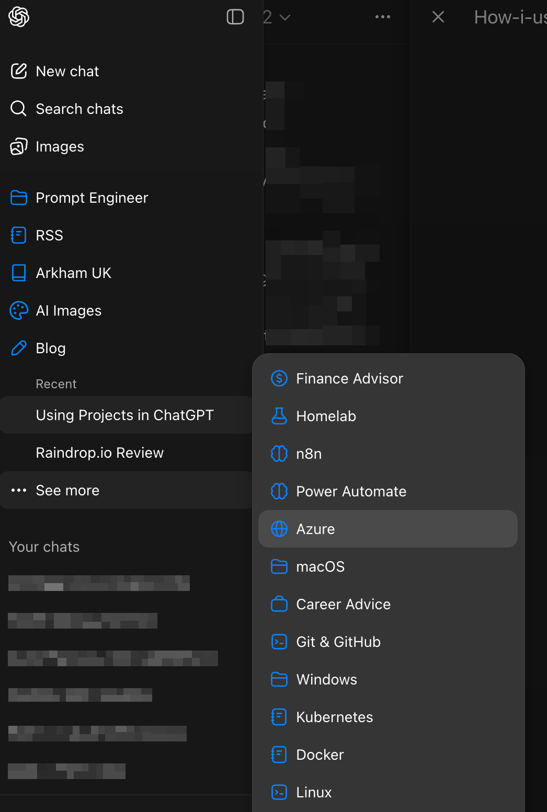
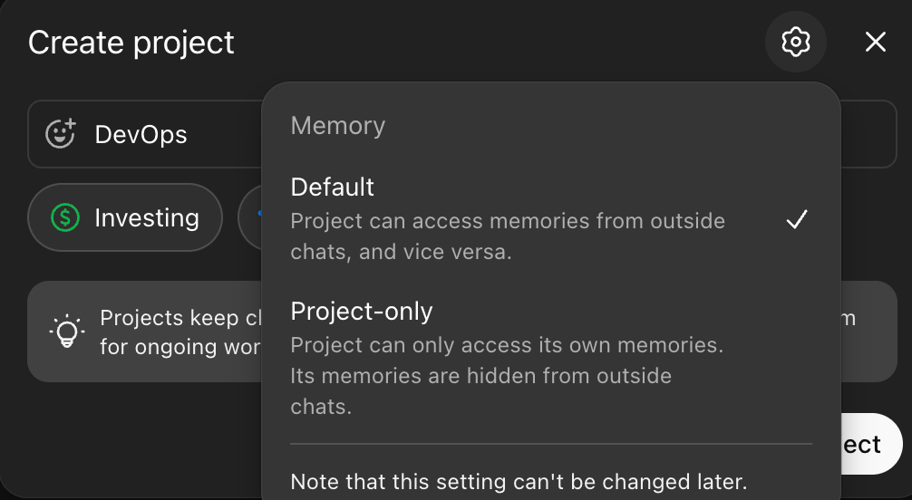

ChatGPT has become more than just a place where I ask questions. It has become part of how I think through ideas and learn new skills.

As my usage grew, one problem became obvious. My chats were starting to blur together and became difficult to manage.

Personal projects overlapped with professional thinking. It all worked, but it wasn’t structured. And for someone who values organised systems, that friction started to bother me.

That was when I started using Projects properly.

## Why I Organise Everything into Projects

I treat Projects as topic boundaries.

Each project represents a distinct area of focus. For example:

* A Linux command line project
* A DevOps CI/CD project
* A documentation or system design project
* A career advisor project

By isolating conversations into a project, I create a contained thinking environment. The chats remain on topic. The context remains relevant. And most importantly, I can find things later without digging through unrelated history.

It feels similar to how I structure documentation in Craft, where everything has a home and nothing is left floating around without context.

The benefit is not just organisational. It directly improves the quality of output.

Here are my current projects:



An example of my Homelab project which I use to help me configure and maintain my homelab applications:


## Moving Away from Static Global Instructions

Initially, I relied heavily on global custom instructions in ChatGPT settings. I spent time crafting detailed, carefully structured prompts to guide tone, style, and behaviour.

The issue I eventually noticed was that they were too static.

Some chats required structured, analytical responses.
Others required reflective writing.
Others required step-by-step hands-on guidance.

A single global instruction block cannot adapt to that nuance. It either becomes too generic or too restrictive.

That realisation changed how I approached configuration.

Instead of relying on global instructions, I now define instructions at the project level. This makes each project context-specific rather than universal.

My global instructions are now simple, by design:

```text
Get straight to the point with clear, concise, and informative responses that focus on key points without unnecessary verbosity. Always use British English with correct spelling, grammar, and appropriate idioms.
```


## Building a Custom Prompt Designer GPT

To make this scalable, I created a custom Prompt Designer GPT. Its job is to help me construct high-quality, prompts for a specific project. Instead of improvising instructions each time, I use this GPT to:

* Define role and behavioural framing
* Clarify goals and outcomes
* Add constraints and tone guidance
* Specify output formats
* Include validation checks or success criteria

The output becomes the instruction set for that project.

This approach gives me two advantages:

1. Consistency within a project
2. Flexibility across projects

A blog-writing project behaves differently from a technical troubleshooting project. An automation  experiment behaves differently from a reflective thinking workspace.

By generating tailored instructions per project, I’m effectively shaping the behaviour of ChatGPT based on the kind of work I want to do.

It feels less like “using a chatbot” and more like configuring a specialist tool.


## Using Project-Specific Documents

In some projects, I upload supporting documents.

These might include:

* Markdown files
* Architecture notes
* Draft specifications
* Research documents
* Structured knowledge bases

When ChatGPT has access to these within the project, the output changes noticeably. It becomes grounded. References are more accurate. The reasoning becomes contextual rather than generic.

This is particularly useful for:

* Ongoing technical projects
* System design work
* Blog writing where tone consistency matters
* AI experimentation where frameworks evolve

The combination of project instructions and uploaded documents creates a much richer working environment.

It stops being a blank conversation each time.

## Projects as Specialists

The best way I can describe Projects is this:

Each one feels like a specialist assistant configured for a particular domain.

One project behaves like a technical mentor.
Another behaves like an editor.
Another behaves like a systems thinker.
Another behaves like a career advisor.

This mirrors how I described GPT-5.2 feeling more capable within workflows rather than isolated questions.

Projects allow me to shape that workflow intentionally.

## Controlling Memory Boundaries

One of the most underrated features of Projects is memory configuration.

You can decide whether a project:

* Can access memories from outside the project
* Or is restricted to project-only memory



In most cases, I select **Project Only**.

I do this deliberately.

If a project is focused on DevOps learning, I don’t want unrelated personal context influencing it. If it’s a blog-writing project, I want tone consistency inside that space, not drift from elsewhere.

Keeping memory scoped ensures:

* Chats stay on topic
* Context remains relevant
* Outputs are more predictable
* Boundaries between domains remain clean

It reinforces the idea that each project is its own workspace.

## The Organisational Effect

The practical benefits are simple:

* I can find conversations quickly
* Context does not bleed between domains
* Instructions evolve per project
* Experiments remain contained
* Long-running initiatives stay coherent

More importantly, it reduces cognitive noise.

Instead of remembering where something was discussed, I know the domain it belongs to.

That alone makes the system worthwhile.

## Final Thoughts

Projects have quietly become one of the most important features in how I use ChatGPT.

They allow me to:

* Think in domains
* Configure behaviour intentionally
* Provide rich contextual grounding
* Keep experiments isolated
* Maintain long-term coherence

Combined with a custom prompt generator and selective document uploads, Projects turn ChatGPT from a general-purpose assistant into a collection of configurable specialists.

For me, that shift has made the tool significantly more powerful and far more aligned with how I actually work.
