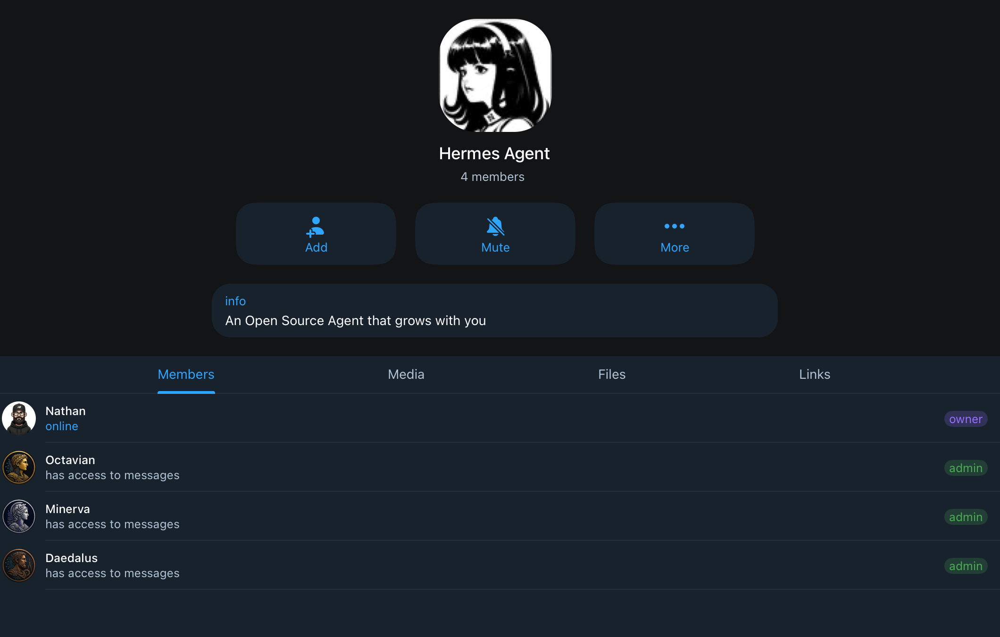
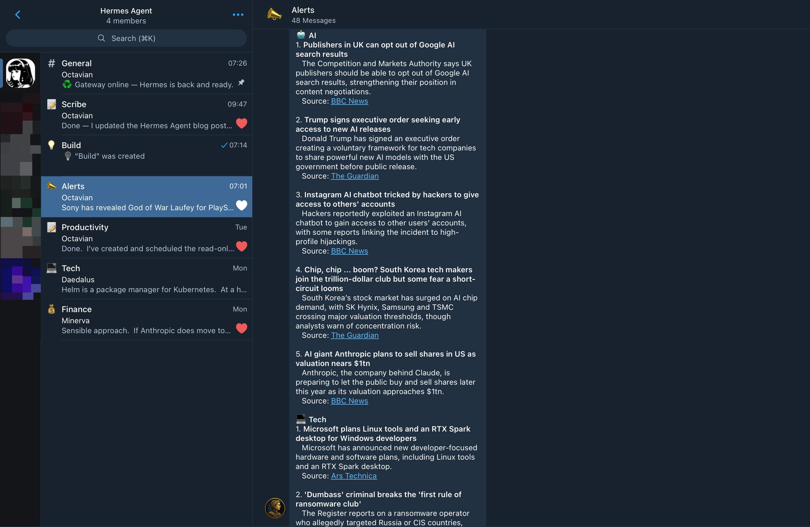
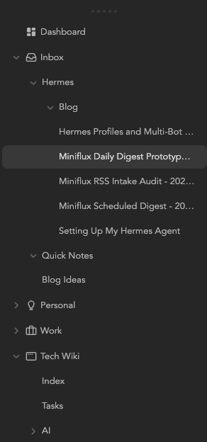

Over the last couple of years, AI tools have slowly become part of how I work, learn, troubleshoot, and organise information. I have written before about using tools like ChatGPT, Codex, Perplexity, NotebookLM, and local models with Ollama, but Hermes Agent feels slightly different.

Rather than being another chat interface, [Hermes Agent](https://hermes-agent.nousresearch.com/) is closer to a personal operating layer. It can communicate through Telegram, use tools, remember useful preferences, work with files, search previous conversations, and help route different types of work into the right context.

That combination is what made me want to spend time setting it up properly.

## What I Wanted from Hermes Agent

I did not want to build a complicated multi-agent system for the sake of it. The goal was much simpler.

I wanted one assistant that could act as a calm front door for the things I already use AI for:

- Technical support
- DevOps tasks
- Coding
- Researching apps and services
- Summarising and organising information
- Capturing useful notes into Obsidian
- General life admin
- Finance-related organisation, with stricter boundaries

The important part was not just capability. It was structure.

My AI conversations can easily become scattered across tools, projects, and random chats. Hermes gives me a way to make that feel more intentional. Instead of every conversation being a blank slate, I can define roles, profiles, project boundaries, and working rules.

That suits the way I like to work.

## Why I Chose Docker

I decided to run Hermes in Docker rather than installing it directly on my host.

This was partly convenience, but mainly isolation. Hermes is an agent with tool access, file access, and the ability to run commands. That is powerful, but it also means I want a clear boundary between the agent runtime and the rest of my system.

Running it in Docker gives me that boundary.

The container becomes the runtime environment. I can mount in only the folders Hermes needs, keep its data under a dedicated directory, and avoid giving it unrestricted access to the host.

That fits the same pattern I use across my homelab: keep services contained, make the configuration explicit, and avoid unnecessary coupling.

At a high level, my setup looks like this:

```text
Host machine
└── Docker container
    └── Hermes Agent
        ├── Telegram gateway
        ├── project workspace
        ├── Obsidian vault access
        └── Hermes data/config
```

This also makes the setup easier to move, rebuild, or roll back later. If something goes wrong, I am dealing with a containerised service rather than a messy host-level install.

## The Basic Docker Compose Setup

My starting point was a Docker Compose service for Hermes with a dedicated data volume and project workspace.

The exact details will vary depending on your own environment, but the shape is simple:

```yaml
services:
  hermes-octavian:
    image: nousresearch/hermes-agent:latest
    container_name: hermes-octavian
    restart: unless-stopped
    command: gateway run

    ports:
      - "127.0.0.1:8642:8642"
      - "127.0.0.1:9119:9119"

    volumes:
      - ./data:/opt/data
      - ./projects:/workspace/projects
      - /path/to/obsidian-vault:/workspace/knowledge/obsidian-vault

    environment:
      HERMES_DASHBOARD: "1"
      HERMES_DASHBOARD_HOST: "0.0.0.0"
      HERMES_DASHBOARD_PORT: "9119"
      API_SERVER_ENABLED: "true"
      API_SERVER_HOST: "0.0.0.0"
```

There are three important mounts here:

- `./data:/opt/data` stores Hermes configuration and runtime data
- `./projects:/workspace/projects` gives Hermes a dedicated working area
- the Obsidian vault mount gives Hermes access to my notes. I am using [Syncthing](https://syncthing.net/) to syncronise my Obsidian vault. Hermes is configured with the boundaries I define

I intentionally avoid mounting my entire home directory. Hermes does not need that level of access for the way I want to use it.

## Telegram as the Main Interface

I use Telegram as the main way to interact with Hermes. It is quick, available on all my devices, and already fits naturally into my normal communication habits. I do not need to open a separate web app or sit at a particular machine. If I have a thought, a question, or a task I want help with, I can send it from wherever I am.

I currently have three bots configured:

- **Octavian**: is the main agent and central operator. I use it for general questions, planning, research, productivity, writing, blog review, knowledge capture, alerts, and routing work into the right place.

- **Daedalus**: is my technical agent. I use it for Linux, Docker, Kubernetes, GitHub, coding, scripting, troubleshooting, technical documentation, and DevOps-related work.

- **Minerva**: is my finance-focused agent. I use it for budgeting ideas, finance admin, general financial education, shopping research, saving-money ideas, and scenario planning. I have not given it access to my personal financial information, and I am not using it to move money or make decisions on my behalf.



One of the most useful parts of the setup has been configuring a Telegram group with topics. Instead of every conversation going into one long chat, I can keep things separated by context.

For example, I have topics for general work, technical work, finance, productivity, alerts, and writing. This keeps each type of conversation in the right place from the start. A Docker issue does not get mixed into a blog draft, finance questions stay separate from general notes, and scheduled alerts or briefings have somewhere obvious to land.

The topic structure also makes it easier for the right agent to respond. Each topic has a clear purpose, and a specific agent can pick up messages based on the context of that topic. If I post in the Tech topic, **Daedalus** responds as my technical agent. Finance-related conversations are handled separately by **Minerva**, while general planning, writing, research, productivity, and alerts are handled by **Octavian**.

It also makes the system feel less like one giant chatbot and more like a small operating environment. I can open the right Telegram topic, ask the question in the right place, and let the correct agent pick it up.



## Keeping the Profile Structure Small

One temptation with agent systems is to create a profile for everything.

I deliberately avoided that.

My current structure is simple:

```text
default / General
├── everyday questions
├── triage
├── planning
├── life admin
├── research
└── knowledge capture

tech / Daedalus
├── Linux
├── Docker
├── Kubernetes
├── Azure
├── GitHub
├── coding
└── technical troubleshooting

finance / Minerva
├── budgeting
├── finance admin
├── shopping research
├── scenario modelling
└── general financial organisation
```

The default profile is the main operator. It handles general questions, planning, routing, and small tasks. Technical work belongs with Daedalus in the `tech` profile. Finance work belongs with Minerva in the `finance` profile and has stricter boundaries.

The reason for using separate profiles is not just personality. It is context control.

Each profile can have its own configuration, memories, working directory, and operating instructions. That means the technical agent can be optimised for safe technical troubleshooting, while the finance agent can be constrained around finance-related organisation and advice boundaries. I do not want every agent carrying every piece of context all the time.

That separation gives me cleaner conversations, better memory hygiene, and more confidence that each agent is operating within the right scope.

You can read more about configuring profiles [here](https://hermes-agent.nousresearch.com/docs/user-guide/profiles/).

## SOUL.md, AGENTS.md, and Strict Boundaries

A big part of making Hermes useful has been defining requirements outside the chat itself.

I use `SOUL.md` and `AGENTS.md` files to describe how each agent should behave, what it is responsible for, and where its boundaries are. This gives the setup a much stronger foundation than relying on vague prompts or hoping the agent remembers what I meant last time.

The distinction is important:

- `SOUL.md` defines the agent’s identity, tone, purpose, and operating principles
- `AGENTS.md` defines the project rules, file boundaries, workflows, and practical instructions
- Profile-level memory stores durable facts and preferences that are specific to that agent’s area of work

For example, the technical agent has rules around inspecting before changing, establishing the target environment, avoiding destructive commands without approval, and documenting useful fixes. The finance agent has much stricter boundaries around sensitive information, advice, and what it should never do.

This is much better than trying to cram every detail into memory.

Memory should be small and durable. Project knowledge belongs in files. Reusable procedures belong in runbooks or skills. Longer-term notes belong in Obsidian.

That separation is the part I like most. It lets each agent work with the right context without the whole system turning into a noisy, overloaded prompt.

## Syncing My Obsidian Notes

I also wanted Hermes to work with my Obsidian vault.

Obsidian is where I want durable knowledge to live: notes, runbooks, decisions, research summaries, technical explanations, and anything useful enough to keep beyond the current conversation.

The approach is intentionally cautious.

Hermes has read-only access to most of the vault so it can use my notes as additional context. Write access is limited to a dedicated inbox area:

```text
Obsidian Vault
└── Inbox
    └── Hermes
```

That means Hermes can draft notes, summaries, runbooks, research reports, and documentation without freely editing the rest of the vault.

The workflow is:

1. I ask Hermes to research, summarise, or document something.
2. Hermes writes the output into `Inbox/Hermes`.
3. I review it later in Obsidian.
4. If it is useful, I move it into the right permanent location.

This gives me the benefit of agent-assisted note capture without losing control of the vault.

It also fits how I think about a second brain. The inbox is for capture. The vault is for organised knowledge.



## What I Am Using Hermes For

At the moment, Hermes is becoming a central assistant for a few recurring patterns.

### Technical Support

If I am troubleshooting Linux, Docker, Kubernetes or a service in my homelab, I can use Hermes to inspect, reason, and document the fix. I also use it to review technical documentation before I rely on it or publish it elsewhere.

### Content Reviewer

Hermes can act as a second pair of eyes for my blog posts, checking structure, clarity, tone, spelling, and obvious issues before I post something publicly. It is not there to replace my judgement, but it is very useful for catching things I might miss.

### Research Assistant

I have Hermes collate news articles on subjects I am interested in, especially technology and AI, and send me a daily briefing at 7am. That gives me a useful summary without needing to manually scan every source first thing in the morning.

If I want to understand a technical subject properly, Hermes can gather information, structure it into an in-depth report, and send the result to my Obsidian vault for review. That is a much better workflow than leaving useful research buried in a chat thread.

### Coding & Scripting

I use Hermes for creating small utilities, scripts, and personal or work-related automation tasks. Hermes is connected to my GitHub account and it can understand my code base and push and pull changes. If I want a tool, I ask Hermes to build it and iterate on it. It is very useful for building out a personal library of tools.

### Finance

I use the finance agent for general financial education, budgeting ideas, shopping research, and ways to shop smarter or save money. I have not given Hermes access to any of my personal financial information, and I am not using it to move money or make decisions on my behalf. It is there to help me think more clearly and be more organised with finances.

Hermes helps me keep those boundaries clearer.

## Skills, Plugins, and Learning Over Time

One of the things that has impressed me most is the number of skills Hermes has available.

The full skills catalogue is available in the Hermes documentation, including built-in and community skills:

[https://hermes-agent.nousresearch.com/docs/skills/](https://hermes-agent.nousresearch.com/docs/skills/)

Skills are reusable instructions that Hermes can load when a task needs a particular workflow. That might be working with GitHub, reviewing a pull request, using Obsidian, creating a PowerPoint deck, summarising YouTube content, managing cron jobs, or interacting with a specific tool.

What feels clever is that Hermes is good at pulling in the right skill based on the task. If I ask it to do something involving Obsidian, GitHub, scheduled jobs, or technical troubleshooting, it can use the relevant skill rather than treating every request as a generic chat prompt.

That said, there is an obvious security point here. Community skills should be reviewed before introducing them into your own setup. A skill can contain procedural instructions that influence what the agent does, so it is worth checking what you are installing and making sure you trust the source.

The way Hermes learns is also impressive. Its memory feature is already useful, and it seems to get better the more I interact with it. The important thing is using memory carefully. I want Hermes to remember stable preferences and recurring conventions, not fill its memory with temporary task details that will be stale in a week.

That combination of profiles, skills, memory, project files, and Obsidian gives the system a much more durable feel than a normal chat history.

## Backing Up the Setup

Because Hermes is becoming part of my workflow, I also wanted to make sure the configuration and data are backed up properly.

I use Restic to back up my Docker volumes to a Backblaze B2 bucket. This runs every day at 2am.

That backup includes the Hermes agent configuration and data, so if something goes wrong with the host, the container, or the underlying volumes, I have a recovery path.

This is not the exciting part of the setup, but it is important. Once an agent starts accumulating useful configuration, memories, skills, schedules, and project context, it becomes something worth protecting.

## Why This Feels Different from a Normal Chatbot

The difference is not that Hermes can answer questions. Lots of tools can do that.

The difference is that Hermes can sit closer to my actual working environment.

It can understand the structure I have defined. It can use files. It can work inside a project folder. It can search previous sessions. It can write notes. It can run scheduled jobs. It can use skills. It can help me preserve useful knowledge instead of making me manually copy everything out of a chat window.

That makes it feel less like a chatbot and more like an operating layer for personal workflows.

I still want clear boundaries. I do not want an agent making sensitive decisions, moving money, or making large changes without approval. But within those boundaries, it is a useful way to reduce friction.

## Lessons So Far

A few things stood out during the setup:

- Keep the structure small. It is easy to overdesign an agent system. Starting with a small number of profiles, clear Telegram topics, and well-defined project folders is enough.

- Docker is worth it. For an agent that can use tools and run commands, container isolation gives me much more confidence.

- Profile boundaries matter. Separate context and memory make the agents more useful because each one can stay focused on the kind of work it is supposed to handle.

- Memory should not become a dumping ground. The more durable approach is to keep memory for stable preferences and use files, notes, project documentation, and skills for everything else.

## Final Thoughts

Hermes is still early in my workflow, but it already feels like the right kind of tool for how I work.

It gives me a Telegram-based interface, a containerised runtime, clear project boundaries, specialist profiles where they are useful, separate context and memories, cautious access to my Obsidian vault, scheduled briefings, and a growing library of skills.

Most importantly, it keeps the system practical.

I am not trying to build a complex network of agents for the sake of it. I am trying to build a reliable set of assistants that can help me think clearly, troubleshoot technical problems, review content, research properly, capture useful knowledge, and keep momentum across the things I care about.

I will keep exploring more use cases as time goes on, but so far I am impressed.

That is where Hermes fits for me: not as a novelty, but as a structured layer between my conversations, my tools, my notes, and the work I want to get done.
