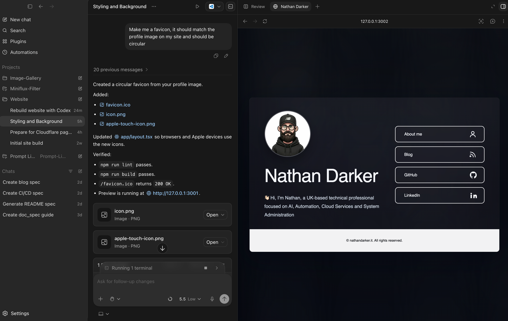

For a long time, my personal website was something I had online, but not something I felt fully in control of.

It was hosted with a web hosting company, which worked well enough on the surface. The site loaded, the domain pointed to it, and it did the basic job of giving me a small presence online. But over time, the limitations started to bother me.

I did not have the level of control I wanted over the source files. Making changes felt more awkward than it needed to be. I also had limited visibility over useful metrics and the way the site was actually being served. On top of that, I was paying an annual hosting fee for something that had become quite a simple personal site.

That combination made me think it was time to take the site back under my own control.

## Why I Wanted to Rebuild It

My website is not a complicated application. It is a personal homepage for [nathandarker.it](https://nathandarker.it/) with a short introduction, links to my blog and profiles, and an about section.

That simplicity was part of the point. I did not need a heavy hosting setup or a platform where the files felt hidden away from me. I wanted something I could understand, edit, version-control, and deploy without friction.

The main goals were:

- Keep the site simple and fast
- Store the source code in my own GitHub repository
- Make content changes without fighting the hosting setup
- Use a modern but maintainable stack
- Deploy automatically when I push changes
- Remove the annual hosting cost

This is where Codex became useful. I had the goal, but I wanted help turning that into a clean, working project structure.

## Using Codex to Shape the Project

The process started with describing what I wanted the site to be - a small personal website, using [Linktree](https://linktr.ee/) as inspiration. I wanted it to look modern, stay easy to maintain, and keep the editable content separate from the layout as much as possible.

Codex helped turn that into a working project using:

- Next.js
- TypeScript
- Tailwind CSS
- GitHub for source control
- Cloudflare Pages for deployment

The important part for me was not only that Codex could write the code. It helped me think through the structure of the project.

A really cool feature within Codex is the built-in browser, which allows you to preview the site as well as annotate sections of the site and describe any changes you wish to make.



Instead of scattering text and links throughout different files, the editable site copy lives in a dedicated content file. That means I can update the introduction, About text, footer, and external links without digging through the whole application.

That is a small detail, but it makes a big difference when you want a site to be maintainable.


## Taking Back Control of the Source

One of the biggest changes is that the source now lives in my own GitHub repository:

[https://github.com/aut0nate/My-Website](https://github.com/aut0nate/My-Website)

That gives me a proper history of the site. Every change is tracked. If I update some text, adjust a link, or change the layout, I can see exactly what changed and when.

For somebody who values documentation and repeatable workflows, that matters.

It also means the site is no longer something that only exists inside a hosting provider's control panel or file manager. The website now starts from the repository. The repository is the source of truth.

In practical terms, the workflow becomes much cleaner:

1. Make a change locally.
2. Test the site.
3. Commit the change to Git.
4. Push it to GitHub.
5. Let Cloudflare rebuild and deploy it.

That feels much closer to how I want to manage personal projects.

## Why Cloudflare Pages?

[Cloudflare Pages](https://developers.cloudflare.com/pages/) is designed for deploying websites from a Git repository. Once it is connected to GitHub, it can automatically build and deploy the site whenever changes are pushed.

For my use case, that is ideal.

I do not need to manually upload files. I do not need to log into a hosting panel to make small changes. I do not need to keep paying for a traditional hosting package just to serve a lightweight personal website.

Cloudflare also fits well because I already think of my website as a static, content-focused presence. It does not need a database or complex server-side behaviour. It needs to be easy to update, quick to serve, and simple to reason about.

The deployment model is straightforward:

- GitHub stores the source code
- Cloudflare Pages watches the repository
- A push to the production branch triggers a build
- Cloudflare deploys the updated site
- The custom domain points to the new deployment

That removes a lot of manual effort.


## The New Editing Workflow

The biggest day-to-day benefit is how easy it is to make changes now.

If I want to update my about section, change a link, or refine the wording on the homepage, I can open the project locally and edit the content file. I can then run the site on my machine to check it before pushing anything.

A typical local workflow looks like this:

```bash
npm install
npm run dev
```

Once I am happy with the change, the Git workflow is familiar:

```bash
git add .
git commit -m "Update homepage copy"
git push
```

After that, Cloudflare Pages handles the rebuild and deployment.

This is the part that feels most valuable. The site is still simple, but it is now simple in a way that gives me more control, not less.

## What I Learned

The biggest lesson from this rebuild is that ownership matters.

Traditional hosting is not wrong. For many people it is still a perfectly sensible option. But for my personal website, it had started to feel like unnecessary friction. I wanted the files, the deployment process, and the future direction of the site to be in my hands.

Codex helped reduce the barrier to making that happen. It gave me a way to move from a rough idea to a working repository, while still letting me stay involved in the decisions.

I still had to think about the project properly:

- What should the site actually do?
- What content should be easy to edit?
- What stack is simple enough to maintain?
- How should deployment work?
- What should stay out of source control?

Those questions matter. Codex can help with the implementation, but it is still important to understand the shape of what you are building.

## Final Thoughts

Rebuilding my website with Codex and deploying it through Cloudflare Pages has made the whole setup feel more like mine.

I have control over the source files. I have a GitHub repository with the full history. I can make changes locally, push them, and let Cloudflare rebuild and deploy the site. I also avoid paying annual hosting fees for a site that does not need a traditional hosting package.

For me, that is the real value of this rebuild. It is not about making the website more complicated. It is about making it easier to manage, easier to change, and easier to own.
