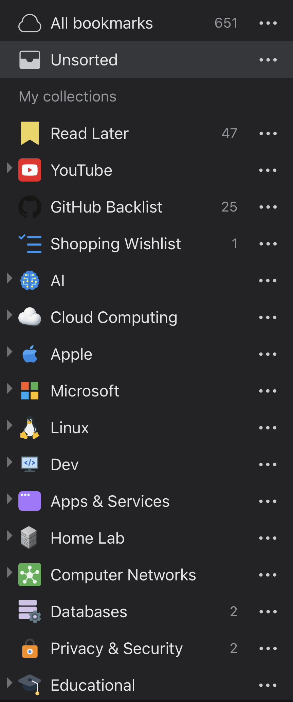
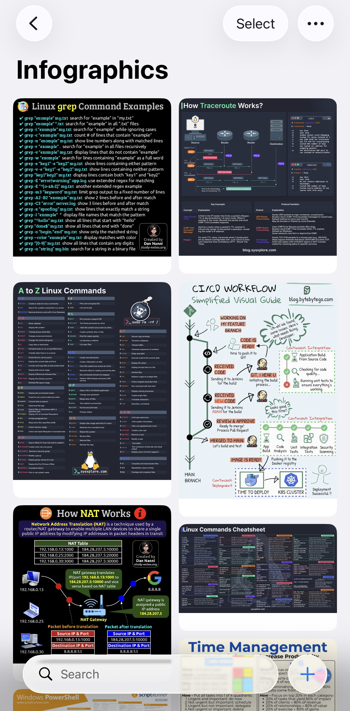
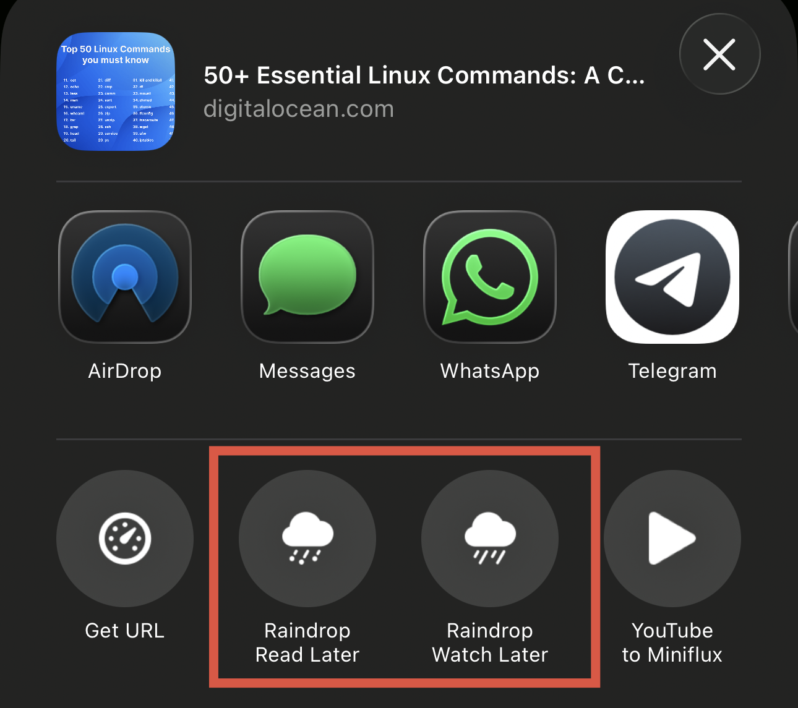

—
title: “Using Raindrop.io to Preserve the Web”
date: 2025-07-15
tags: [productivity, raindrop]
—

Like most people, I spend a lot of time reading, researching, and collecting things from across the web. I am always aware of how easily useful content can disappear or be forgotten over time. Blog posts, documentation, bash scripts, YouTube videos, services I want to explore later, and images which sparked a bout of nostalgia. Over time, I learned that browser bookmarks alone were not enough. I needed a smart, searchable digital scrapbook and that is how I discovered [Raindrop](https://raindrop.io/).

## More Than Just Bookmarks

That sense of fragility is what pushed me to look beyond traditional browser bookmarks in the first place.

At a basic level, Raindrop is a bookmarking service, but that description undersells what it actually does. I use it as a long-term archive of things I may need again in the future.

One feature I have come to rely on heavily is page preservation. When you save a link, Raindrop stores a copy of the page itself. That matters more than it might sound. Blogs disappear, domains expire, and useful information can quietly vanish. I have lost count of the number of times I have gone back to something saved years ago only to find the original site gone.

Knowing that a snapshot exists removes a lot of anxiety. It turns bookmarking from a hopeful gesture into something closer to digital preservation.

## How I Use Raindrop Day to Day

I deliberately keep my collections simple. Over time I have found that fewer categories and clearer intent reduce cognitive load and make the system easier to maintain long term.

My collections are fairly simple, but they cover a wide range of use cases:

- Documents and files, including PDFs and reference material
- YouTube videos I want to watch later or refer back to
- Tweets and short-form content that would otherwise disappear
- A digital scrapbook for ideas, inspiration, and visual references

Everything ends up searchable, tagged, and organised in a way that suits how I think rather than how a platform wants me to behave.

## Reducing Friction on iOS

Raindrop’s iOS share sheet is excellent. It gives you full control over where things go, how they are tagged, and how they are organised. That said, I found that when I am casually browsing, even a good share sheet can feel like too much friction.

To work around this, I created two simple iOS shortcuts:

- One to quickly bookmark links into a Read Later collection
- One to bookmark YouTube videos into a Watch Later collection

This gives me a single tap way to save something and move on. If something is genuinely worth deeper organisation, I can do that later. Most of the time, the important thing is simply not losing it.

## Thoughtful Design and Consistency

One thing Raindrop gets consistently right is design. The apps are well considered, visually calm, and consistent across platforms. The web app and mobile apps all feel like parts of the same product rather than separate interpretations of it.

Updates arrive regularly, and they tend to be incremental improvements rather than disruptive changes. That stability matters for a tool that quietly sits at the centre of how you collect information.

## Self-Hosted Alternatives

Alongside hosted services, I have an interest in self-hosted tools, which I have written about previously. That interest is driven by curiosity, a desire for long-term resilience, and thinking more carefully about data ownership.

At the moment, Raindrop’s feature set and level of polish give it a clear edge for me. It remains my primary tool. That said, there are some excellent self-hosted alternatives available, including [Linkwarden](https://linkwarden.app/) and [Karakeep](https://karakeep.app/).

I am currently experimenting with Karakeep alongside Raindrop and watching its development closely. It is still early days, but I can see myself writing about that experience in more detail once I have lived with it for a while.

## The Missing Piece: Offline Mode

If there is one real weakness in Raindrop for me, it is the lack of an offline mode. This is something many users have requested over the years, and I hope it eventually lands.

I understand the complexity. Some collections can grow very large, and storage constraints are real, particularly on mobile devices. Still, I would like to see a more selective approach. For example:

- Offline access for a specific collection
- The ability to download a selection of articles

That would cover a lot of practical scenarios, especially travelling. Being able to read saved articles offline on a train or plane feels like a natural extension of what Raindrop already does well.

## Final Thoughts

Overall, Raindrop has earned its place in my workflow. It is reliable, well designed, and quietly useful in a way that many tools are not. More importantly, it treats the web as something worth preserving rather than something disposable.

I do not see it as a replacement for notes or documentation. Instead, it acts as a long-term memory layer for the internet itself. It sits alongside my notes and documentation, capturing raw inputs before they are refined, summarised, or turned into something more permanent.

When something is worth saving it goes into Raindrop. Over time, some of those bookmarks fade into the background, while others resurface and feed directly into my wider knowledge management system.

Years later, future me is usually grateful that it did.
