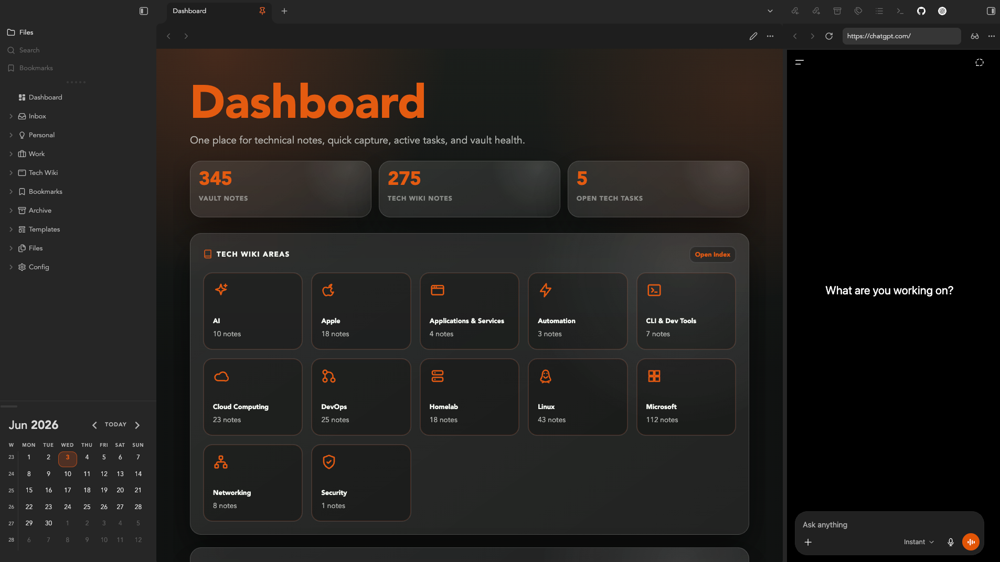

For the last few years, [Craft](https://www.craft.do/) has been my main place for personal knowledge management. I have rated it highly for a long time, and I still think it is an excellent tool. It helped me build a proper documentation habit, organise my technical notes, and keep a useful personal knowledge base that I could rely on.

But over time, the way I used Craft started to change.

I was still using it regularly, but I was using fewer of the features that originally made it so appealing. My notes were becoming more about durable knowledge: technical references, project notes, personal documentation, snippets, workflows, and things I wanted to be able to search, edit, automate, and reuse over time.

That made me start looking again at [Obsidian](https://obsidian.md/).

## What Is Obsidian?

Obsidian is a note-taking and knowledge management app built around local Markdown files. Instead of storing your notes inside a proprietary workspace, Obsidian works with a folder of plain text files, known as a vault. Those files can live on your machine, in iCloud, Dropbox, GitHub, or wherever else you choose to store them.

That simple foundation is a big part of the appeal.

Obsidian has become one of the most popular tools in the personal knowledge management space, especially among people who care about note-taking, research, writing, technical documentation, and building a second brain. It has a large community, thousands of [plugins](https://community.obsidian.md/), a strong theme ecosystem, and enough flexibility to support anything from a simple notes folder to a heavily customised knowledge system.

For me, the important part is that Obsidian starts from Markdown. The notes are just files. They are portable, readable, easy to back up, and not locked into one application.

## Why I Decided to Move

This was not a move away from Craft because I disliked it. Quite the opposite. Craft has been one of the best productivity tools I have used, and it played a big role in helping me take personal documentation seriously.

The reason for moving was more about fit.

I wanted something that gave me:

- More control over the underlying files
- A cleaner Markdown-first workflow
- Better portability if I ever changed tools again
- A more future-proof structure for long-term notes
- A format that works naturally with tools like Codex and Hermes Agent
- Less reliance on an external API or MCP server for automation

Craft’s MCP server is genuinely interesting, and I still think it opens up some powerful workflows. But for the way I want to use Hermes with my notes, plain Markdown is simpler. Hermes can read, search, edit, summarise, and help maintain Markdown files directly. There is less translation involved, fewer moving parts, and a much clearer relationship between the tool and the data.

That matters to me. I want my knowledge base to feel like something I own, not something I can only interact with through a specific app or integration layer.

## Why I Had Not Moved Earlier

I have tried Obsidian before.

The problem was never really Obsidian itself. The problem was the migration.

Moving a large number of notes from one system to another is not just a file transfer. It means dealing with formatting issues, exports, folder structures, attachments, links, naming conventions, and all the small details that make a knowledge base feel usable rather than dumped into a folder.

In previous attempts, that friction was enough to stop me.

I could see the value in Obsidian, but I did not want to spend days manually cleaning up notes, reorganising folders, and trying to recreate a system that matched how I actually work. The cost of moving felt higher than the benefit, so I stayed with Craft.

This time was different because I had Codex.

## Using Codex to Help With the Migration

The migration started by exporting my Craft workspace as text bundle files. From there, I created a project in Codex and pointed it at the exported files.

That gave me a much better way to approach the move. Instead of treating it as a manual clean-up job, I could work with Codex to understand the exported structure, identify formatting issues, and gradually shape the vault into something more useful.

Codex helped me with things like:

- Reviewing the exported folders and files
- Cleaning up Markdown formatting issues
- Tidying inconsistent file names
- Organising notes into a structure that made sense
- Preserving useful content while removing clutter
- Checking that the vault remained readable and navigable

My Obsidian vault is stored in iCloud, which means it is available across my devices while still remaining a normal folder of Markdown files. That gives me the convenience I want without giving up control of the underlying data.

The difference this time was momentum. I did not have to solve every small migration problem manually. I could describe what I wanted, review what Codex suggested, and work through the transition in manageable steps.

## Customising Obsidian

Once the files were organised, I spent some time making Obsidian feel right.

One of the things I like about Obsidian is that it can be as simple or as customised as you want it to be. Out of the box, it is already useful, but the real strength comes from being able to shape the environment around your own workflow.

I watched a few YouTube videos to get a better feel for how other people set up their vaults, which helped me understand what was possible without immediately overcomplicating things.

For the visual side, I decided to use the [Baseline](https://github.com/aaaaalexis/obsidian-baseline) theme. It gives Obsidian a clean, polished feel while still keeping the focus on the notes themselves. That balance matters to me. I want the environment to look good, but I do not want the design to get in the way of writing, searching, and working.

Channels I found helpful with this process:

[Linking Your Thinking with Nick Milo](https://www.youtube.com/@linkingyourthinking)
[Mike Schmitz](https://www.youtube.com/@MikeSchmitz)
[LeanProductivity - Sascha D. Kasper](https://www.youtube.com/@leanproductivity)

## Community Plugins

Obsidian’s plugin ecosystem is one of its biggest strengths. There are plugins for writing, dashboards, databases, calendars, task management, visualisation, automation, publishing, and almost every other workflow you can imagine.

I did not want to install plugins just for the sake of it, so I took a fairly selective approach. The goal was to add functionality where it genuinely improved how I use the vault, not turn Obsidian into something heavy or fragile.

Plugins I decided to use:

- [Style Settings](https://community.obsidian.md/plugins/obsidian-style-settings)
- [Tasks](https://community.obsidian.md/plugins/obsidian-tasks-plugin)
- [Code Styler](https://community.obsidian.md/plugins/code-styler)
- [Dataview](https://community.obsidian.md/plugins/dataview)
- [Iconize](https://community.obsidian.md/plugins/obsidian-icon-folder)
- [Excalidraw](https://community.obsidian.md/plugins/obsidian-excalidraw-plugin)

I will probably keep refining this list over time, but I like that Obsidian lets me build the system gradually. I can start simple, add what is useful, and remove anything that becomes unnecessary.

## Adding Polish With Bases, Dataviews, and CSS

After the main migration was complete, I used Codex again to help improve the look and feel of the vault.

This is where things became especially fun. Once the notes were in Markdown and the vault structure was clear, Codex could help me work on the environment around the notes rather than only the notes themselves.

I explored ways to use [Bases](https://obsidian.md/help/bases), Dataview, and custom CSS to add a bit more structure and polish. That included making certain views easier to scan, improving how information is presented, and generally making the vault feel more like a properly designed workspace rather than a basic folder of Markdown files.

I like this approach because it keeps the foundation simple. The notes are still Markdown. The files are still portable. The extra layers improve the experience and that is the balance I wanted.

I landed on the idea of a Dashboard, which acts as a portal to my knowledge. I worked with Codex on the design and I am very pleased with the final result:

## Why Agentic Tools Made the Difference

The whole project did not take as long as I expected.

A big reason for that is the way agentic tools change the nature of this kind of work. Instead of sitting there manually fixing every file, checking every folder, and trying to remember every configuration step, I could give Codex clear tasks and let it work through them while I got on with other things.

That is what makes these tools so useful.

They are not just chatbots that answer questions. Used properly, they can take on real work: reviewing files, making changes, testing assumptions, cleaning up structure, and helping move a project forward while you stay focused on the decisions that matter.

You still need to guide the process. You still need to review the output. But the amount of friction they remove is significant.

For a migration like this, that made all the difference.

## How It Feels Now

I am really pleased with how the move turned out.

The vault now feels organised, searchable, and aligned with how I like to work. Everything is easier to find, the structure makes sense, and the whole setup feels much more under my control.

I have also learned a lot about Obsidian along the way. That is one of the nice side effects of doing the migration properly rather than just dumping files into a folder. I now understand more about themes, plugins, Dataview, Bases, CSS snippets, and how the different pieces can fit together without making the system too complicated.

Most importantly, I feel more confident about the future of my notes.

Because the vault is Markdown-based, I know the content is portable. Because it lives in iCloud, it is available across my devices. Because it works naturally with Codex and Hermes, I can keep augmenting it with AI-assisted workflows without needing to rely on a specific application integration.

That combination feels right for the way I work now.

## Final Thoughts

Moving from Craft to Obsidian has been a really enjoyable project.

Craft was the right tool for me for a long time, and I still rate it highly. But my needs have shifted towards something more file-based, portable, automation-friendly, and Markdown-native.

Obsidian gives me that. Codex made the transition easier. Hermes gives me a way to build on top of it.

I now have a system that feels properly organised and shaped around how I think, write, learn, and work. I am already enjoying using Obsidian for both personal and work notes, and I am looking forward to seeing how far I can take it from here.

For me, that is the best kind of tool change. Not switching because something is broken, but switching because the new setup fits the next stage of how you want to work.
